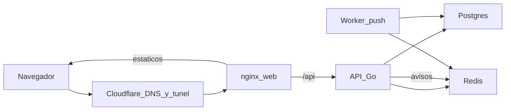

# Arquitectura de Rumbo

Octubre 2026. Describe el sistema que corre hoy en la placa de casa. No es un plan de migración.

## Cómo llega una visita

El navegador habla con Cloudflare. Ahí terminan el DNS y el TLS de `apprumbo.online` (la página) y `mi.apprumbo.online` (la app). Un contenedor `cloudflared` abre el túnel hacia afuera y entrega el tráfico a nginx, dentro de la red de Docker. La placa no publica el puerto 443.

nginx está en [apps/web/nginx.conf](../apps/web/nginx.conf). Los archivos de la app y de la landing salen de disco. Lo que empieza por `/api/` se reenvía a `api:8080`. `www.apprumbo.online` redirige al apex en Cloudflare; el túnel no lo publica.

## Qué corre en la placa

Producción es el perfil `tunnel` de [deploy/compose.yaml](../deploy/compose.yaml). Un solo `docker compose` levanta todo en la misma máquina.

| Servicio | Qué hace | Tope de memoria |
| --- | --- | --- |
| `postgres` | Datos. Postgres 16. Volumen `pgdata`. | 512 MiB |
| `redis` | Cola de avisos. 64 MB; si se llena, bota lo más viejo. | 96 MiB |
| `api` | API en Go. Sesión en una cookie firmada. Publica los recordatorios en Redis. | 128 MiB |
| `worker` | Lee esa cola y manda el push. | 64 MiB |
| `web` | nginx. Estáticos y proxy hacia la API. | 64 MiB |
| `cloudflared` | Túnel. El token vive en `deploy/.env`, que no está en git. | 128 MiB |

Redis no guarda la sesión de cada visita: la cookie viaja con el navegador y la API la verifica sola.

El reloj de la app sale de `APP_TIMEZONE` en `deploy/.env`. El ejemplo del repo dice `America/Bogota`. Lima marca la misma hora (UTC−5, sin horario de verano).

Para publicar un cambio: `rumbo publicar`. Baja la rama con fast-forward, reconstruye las imágenes en la placa y espera a que `/healthz` de la API responda. Postgres no se borra: los datos están en el volumen `pgdata`.

No hay copia de seguridad de `pgdata` en este repositorio. Si se pierde el disco, se pierde la base.

## Para crecer

Hoy es una sola máquina, una sola API y una sola base, detrás del túnel. Para que aguante más gente haría falta una copia de la base fuera de la placa, más de un proceso de API y Postgres en otra máquina.
