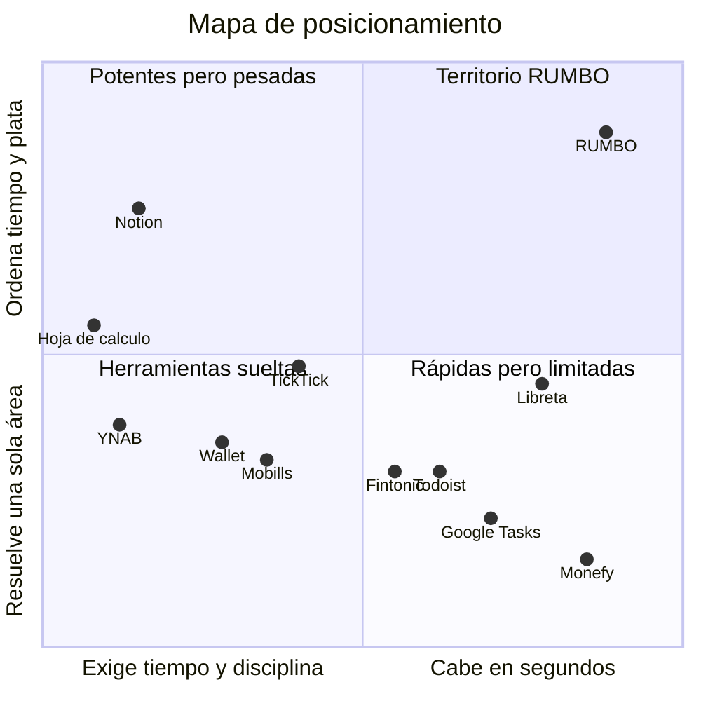
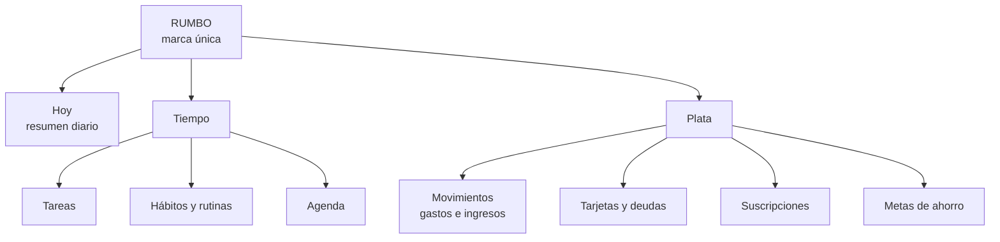
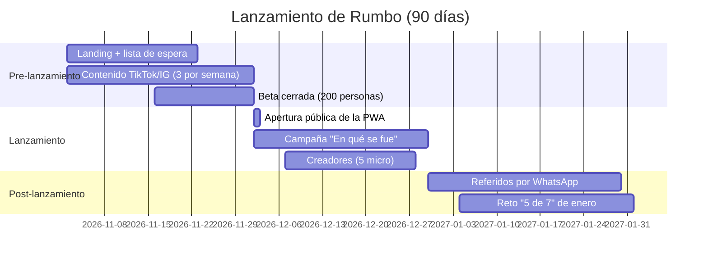

# Manual de marca de RUMBO

Versión 2.0 · Octubre 2026 · Archivos relacionados: [`tokens.css`](./tokens.css), [`tokens.json`](./tokens.json), [`logo/`](./logo/)

> **Cambio de dirección visual (v2.0).** La v1.0 proponía una identidad terracota con un símbolo de aguja de brújula. Tras explorar la marca en Branda, se eligió una dirección **verde**: símbolo "La flecha" y paleta de verde menta + verde profundo. Las secciones 5, 6, 7 y 9 reflejan la dirección vigente; la estrategia (secciones 1 a 4 y 8) no cambió. La referencia visual que originó el cambio está en [`exploraciones/branda/branda-direccion-verde.jpg`](./exploraciones/branda/branda-direccion-verde.jpg).

## 0. Supuestos de partida

Estas respuestas fijan el marco del manual. Si alguna cambia, revisa las secciones indicadas.

| Decisión | Respuesta | Qué condiciona |
| --- | --- | --- |
| Monetización | Gratis por ahora; la monetización se define después | Mensajes (sección 8), objeciones, plan de lanzamiento. Nunca prometemos "gratis para siempre"; decimos "gratis" y "sin anuncios". |
| Nombre de empresa | No hay empresa separada; RUMBO es la marca de todo | Arquitectura de marca (sección 4), firma de correo y avisos legales. |
| Tono | Cercano y seguro: como un amigo ordenado, con humor sutil | Voz y microcopy (sección 4). |
| Color | Libertad total | Paleta propia en verde (v2.0): menta de alto impulso + verde profundo. Reemplaza el papel/teal provisional y la propuesta terracota de la v1.0. |
| Finanzas | Registro manual al inicio; conexión bancaria en el futuro | La promesa se apoya en "registrar en 5 segundos", no en "se conecta solo". El registro rápido es parte central del producto. |

Supuestos adicionales que asumí:

- **Sin anuncios ni venta de datos.** Es la única forma creíble de pedir que alguien anote su plata a mano.
- **Funciona offline.** Es una PWA y una de las personas trabaja en campo con señal intermitente.
- **Perú primero.** Moneda por defecto: soles (S/), con dólares como segunda moneda (muy común en tarjetas y deudas en Perú).

---

## 1. Esencia de marca

### Propósito

Que la gente ocupada sienta que su vida va a algún lado: que sabe en qué se le va el tiempo y la plata, y puede corregir el rumbo sin dedicarle horas que no tiene.

### Visión

Ser, en 2030, la app que los jóvenes que trabajan en Latinoamérica abren cada mañana para saber cómo va su día y su mes, en un solo vistazo.

### Misión

Juntar en una sola app tareas, hábitos y plata, con un registro tan rápido que entre en los huecos del día, y mostrarle a cada persona su avance de forma clara y sin culpa.

### Valores

| Valor | Cómo se ve en el producto |
| --- | --- |
| **Rapidez honesta** | Registrar un gasto o una tarea toma menos de 5 segundos; si algo toma más, lo rediseñamos. |
| **Claridad antes que cantidad** | Cada pantalla responde una sola pregunta ("¿cómo va mi día?", "¿cuánto me queda?"); los detalles están a un toque, no a la vista. |
| **Avance, no perfección** | Si fallas un hábito, la racha no se reinicia a cero: mostramos tu semana y te invitamos a volver. |
| **Sin culpa** | Los gastos no se pintan de rojo; el único color de alerta (granate) es "te pasaste del presupuesto que tú pusiste". |
| **Tu información es tuya** | Sin anuncios, exportación de datos en un toque y explicación en simple de qué guardamos. |

### Personalidad

- **Arquetipo principal: El Guía (Sabio práctico).** RUMBO no te ordena ni te sermonea: te muestra dónde estás y hacia dónde vas. El nombre ya es una brújula. Encaja con el insight central: el público no quiere "ser más productivo", quiere sentir control y dirección.
- **Arquetipo secundario: El Amigo (Persona común).** El guía no está por encima de ti; está a tu lado, habla como tú y entiende que llegaste cansado. Esto evita la frialdad que el público reprocha a las apps de finanzas y productividad.

| Somos | No somos |
| --- | --- |
| Claros | Técnicos |
| Cercanos | Confianzudos |
| Serenos | Aburridos |
| Prácticos | Exigentes |
| Optimistas | Ingenuos (no te decimos que "todo está bien" si te pasaste del presupuesto) |

---

## 2. Público objetivo

### 2.1 Buyer personas

| | Valeria (oficina) | Diego (campo) | Camila (híbrida/freelance) |
| --- | --- | --- | --- |
| Edad | 28 | 31 | 26 |
| Ciudad | Lima (vive en Surquillo, trabaja en San Isidro) | Arequipa (base) + mina en Moquegua | Trujillo |
| Trabajo | Analista de marketing en una cadena de retail | Supervisor de operaciones en minera, régimen 14x7 | Diseñadora UX freelance + medio tiempo en agencia remota |
| Ingreso aprox. | S/ 4,800 / mes, fijo | S/ 7,500 / mes, fijo + bonos | S/ 3,000 a 6,500 / mes, variable, parte en dólares |
| Rutina | Sale 7:00, 50 min en el Metropolitano, reuniones todo el día, sale 18:30, gimnasio 2 veces por semana (cuando puede) | En mina: turno de 12 h, 5:00 a 17:00, poca señal. En franco: familia, trámites, todo lo que se acumuló | Despierta 8:30, trabaja en casa o cafés, picos de trabajo por entregas, fines de semana difusos |
| Dispositivos | iPhone 13, laptop del trabajo | Android gama media (Samsung A54), tablet en casa | Android (Xiaomi), MacBook personal |
| Apps que usa | WhatsApp, Instagram, TikTok, Yape, app de su banco, Rappi, Google Calendar del trabajo | WhatsApp, Facebook, YouTube, Yape, app del banco, Spotify offline | Notion, Figma, Instagram, LinkedIn, Plin, PayPal, Wise |
| Frustraciones | El sueldo "desaparece" antes del 20; muchas suscripciones; se olvida de pagos de la tarjeta | Al bajar de mina no sabe en qué gastó; quiere ahorrar para una casa y no avanza; los hábitos se rompen con cada cambio de turno | Ingresos irregulares le dan ansiedad; mezcla plata personal y del trabajo; tiene 4 apps para organizarse |
| Lo que ya intentó | Excel con fórmulas (lo dejó en marzo); Fintonic (no conecta bien con su banco) | Libreta en el casco/mochila; una app de hábitos que exigía check diario | Notion con plantillas de finanzas (demasiado tiempo armándolas); Todoist |
| Por qué falló | Requería sentarse 30 min cada domingo | Sin señal no sincronizaba; las rachas se rompían en cada turno y lo desmotivaban | Mantener el sistema le quitaba más tiempo del que le ahorraba |

### 2.2 Jobs-to-be-done, dolores y ganancias

**Valeria**

- Funcional: saber cuánto le queda para gastar hasta fin de mes y no olvidar pagos ni pendientes del día.
- Emocional: dejar de sentir que el mes "se le va" sin saber en qué.
- Social: poder decir "este año sí viajé con mi plata", sin pedir prestado.
- Dolores: el día 20 ya no sabe cuánto tiene; las suscripciones se cobran solas; las tareas personales compiten con las del trabajo.
- Ganancias deseadas: un número claro ("te quedan S/ 640 para 9 días"), recordatorios de pagos y un hábito de gimnasio que no dependa de la fuerza de voluntad.

**Diego**

- Funcional: registrar gastos y hábitos sin señal, y ver al bajar de mina cuánto avanzó su meta de casa.
- Emocional: sentir que el sacrificio de estar lejos sirve para algo.
- Social: mostrarle a su pareja que el plan de ahorro avanza.
- Dolores: sin internet en turno; rachas que se rompen por el régimen 14x7; los gastos en franco se descontrolan.
- Ganancias deseadas: modo offline, hábitos que entiendan su calendario por turnos y una meta de ahorro visible.

**Camila**

- Funcional: proyectar el mes con ingresos variables y separar lo personal de lo del trabajo.
- Emocional: bajar la ansiedad de "¿me va a alcanzar?".
- Social: sentirse una profesional independiente ordenada, no "la freelance que siempre anda corta".
- Dolores: cobros en dólares y soles; facturas que se atrasan; demasiadas herramientas.
- Ganancias deseadas: una sola app, ingresos esperados vs. reales y tareas del día en el mismo lugar que su plata.

### 2.3 Momentos de uso

| Persona | Momento | Tiempo disponible | Qué hace en RUMBO |
| --- | --- | --- | --- |
| Valeria | En el Metropolitano, 7:15 | 2 a 3 min | Revisa el día y marca la tarea más importante |
| Valeria | Después de almorzar, 13:40 | 30 s | Registra el gasto del almuerzo |
| Valeria | En la cama, 22:30 | 1 a 2 min | Marca hábitos y revisa cuánto le queda del mes |
| Diego | Antes del turno, 4:40 | 1 min | Revisa hábitos del día (offline) |
| Diego | Fin del turno, 17:30 | 2 min | Registra gastos del día y marca hábitos |
| Diego | Primer día de franco | 10 min | Revisa avance de la meta y planifica la semana |
| Camila | Al empezar a trabajar, 9:00 | 3 min | Planifica tareas y revisa cobros pendientes |
| Camila | Al recibir un pago | 20 s | Registra el ingreso (en soles o dólares) |
| Camila | Domingo en la tarde | 5 min | Mira la semana que viene y su proyección del mes |

### 2.4 Disparadores de adopción y razones de abandono

Disparadores de adopción:

1. Quincena o fin de mes en que "no sabe dónde se fue la plata".
2. Inicio de año, cumpleaños o regreso de vacaciones (momentos de "esta vez sí").
3. Una meta concreta con fecha: viaje, casa, boda, mudanza, pagar una deuda.
4. Un susto: un cobro duplicado, una mora en la tarjeta, una suscripción olvidada.
5. Recomendación de un amigo por WhatsApp con captura de su progreso.

Razones de abandono (y cómo las prevenimos):

| Razón | Prevención |
| --- | --- |
| Registrar toma demasiado | Registro en 5 segundos, categorías sugeridas, montos frecuentes en un toque |
| Rachas que se rompen y desmotivan | Rachas por semana (5 de 7 cuenta como semana cumplida), no por día perfecto |
| Configuración inicial larga | Onboarding de 3 pasos; todo lo demás se configura al usarlo |
| Notificaciones molestas | Máximo 2 recordatorios automáticos al día, con horario que elige la persona |
| La app "regaña" | Copy sin culpa; nunca usamos rojo para un gasto normal |
| Sin señal no funciona | Offline primero, con sincronización al volver la conexión |

---

## 3. Posicionamiento

### 3.1 Declaración de posicionamiento

> Para jóvenes de 25 a 35 años que trabajan, tienen poco tiempo y sienten que el día y la plata se les escapan, RUMBO es la app de vida organizada que junta tareas, hábitos y finanzas en un solo vistazo diario. A diferencia de las apps de productividad que exigen disciplina y de las apps de finanzas que se sienten como un banco, RUMBO se usa en los huecos del día, en segundos, y te muestra cuánto avanzas sin hacerte sentir culpa.

### 3.2 Mapa competitivo

| Alternativa | En qué es fuerte | En qué falla para nuestro público |
| --- | --- | --- |
| Todoist | Captura rápida de tareas, muy pulido | Solo tareas; sin plata ni hábitos reales; las funciones útiles son de pago y en dólares |
| Notion | Flexibilidad total, plantillas | Hay que construir el sistema; mantenerlo cuesta más tiempo del que ahorra |
| Google Tasks / Calendar | Ya está en el celular, gratis, integrado al trabajo | Frío, sin hábitos, sin finanzas, sin sensación de avance |
| TickTick | Tareas + hábitos + pomodoro | Demasiadas funciones; nada de finanzas; estética de herramienta |
| Fintonic | Conexión bancaria (en España) | Pensado para otro mercado; conexión con bancos peruanos limitada; se siente como un banco |
| Mobills | Finanzas completas, tarjetas | Interfaz cargada; enfocado en Brasil; nada de tareas o hábitos |
| Monefy | Registro muy rápido | Solo gastos; sin metas reales ni tarjetas; visualmente básico |
| Wallet (BudgetBakers) | Presupuestos, cuentas múltiples | Complejo; la sincronización bancaria no llega bien a Perú; frío |
| YNAB | Metodología sólida de presupuesto | Requiere aprender un método, en inglés y en dólares, de pago |
| Hoja de cálculo | Control total, gratis | Se abandona; no está en el celular a la mano; no recuerda nada |
| Libreta | Inmediata, sin batería, tangible | No suma, no recuerda, se pierde; no muestra avance |



### 3.3 Territorio de marca

**"El vistazo que te devuelve el control."** Nadie ocupa la idea de un único resumen diario que responde a la vez "¿cómo va mi día?" y "¿cómo va mi plata?". Las apps de productividad venden hacer más; las de finanzas venden controlar gastos. RUMBO vende **saber dónde estás y hacia dónde vas, en 10 segundos**.

Razones para creer:

1. **Una sola pantalla "Hoy"** muestra tareas, hábitos y cuánto te queda para gastar, sin cambiar de app.
2. **Registro en 5 segundos**: monto, categoría sugerida, listo. Funciona sin señal.
3. **Avance sin culpa**: rachas semanales, metas con anillo de progreso y gastos que no se pintan de rojo.

### 3.4 Propuesta de valor

En una línea:

> Tu día y tu plata en orden, en segundos.

En tres líneas:

> Tareas, hábitos y finanzas en una sola app.
> Registras en segundos, incluso sin señal.
> Y cada día ves cuánto avanzaste hacia lo que quieres.

### 3.5 Arquitectura de marca



Arquitectura monolítica: no hay submarcas. Las secciones se nombran con palabras comunes ("Hoy", "Tiempo", "Plata"), nunca "RUMBO Finance" o "RUMBO Habits".

---

## 4. Nombre, tagline y voz

### 4.1 El nombre

**Significado.** *Rumbo* es la dirección que sigue alguien para llegar a un lugar. En el habla peruana y latinoamericana tiene dos usos cotidianos que juegan a favor: "tener rumbo" (saber hacia dónde vas) y "perder el rumbo" (desordenarse). Es corto, se pronuncia igual en toda la región y no suena a tecnología fría.

**Narrativa.** No te prometemos llegar más rápido ni hacer más. Te ayudamos a no perder el rumbo cuando el día y el mes se ponen difíciles. Cada tarea hecha, cada hábito cumplido y cada sol ahorrado es un paso en tu dirección.

**Cómo usarlo:**

| Contexto | Forma correcta | Ejemplo |
| --- | --- | --- |
| Logotipo | `rumbo` en minúsculas (solo en el logo) | Ver sección 5.1 |
| Texto corrido, interfaz, prensa | **Rumbo**, con R mayúscula, sin artículo | "Descarga Rumbo", "Rumbo te avisa a las 9:00" |
| Titulares de campaña o contextos legales | **RUMBO** en mayúsculas está permitido | "RUMBO S.A.C." (si se constituye) |
| Hashtag | #ConRumbo | |

**Cómo NO usarlo:**

- Con artículo: ~~"la Rumbo"~~, ~~"el Rumbo"~~ (sí se puede decir "la app Rumbo").
- Conjugado o con juegos: ~~"rumbéalo"~~, ~~"Rumbeando"~~ en comunicaciones oficiales.
- En plural: ~~"los Rumbos"~~.
- Con submarcas: ~~"Rumbo Pro Finance"~~.
- Combinando mayúsculas: ~~"RuMbo"~~, ~~"RUMBo"~~.

> Nota: el prompt pedía "RUMBO". Recomiendo "Rumbo" en texto corrido porque las mayúsculas sostenidas en interfaz se leen como un grito y bajan la legibilidad. Es una de las decisiones a validar (ver final).

### 4.2 Taglines

| # | Tagline | Racional |
| --- | --- | --- |
| 1 | **Tu día y tu plata, con rumbo.** | Nombra las dos mitades del producto y cierra con el nombre. Fácil de recordar. |
| 2 | Pocos minutos, todo en orden. | Ataca directo el dolor de la falta de tiempo; no dice qué ordena. |
| 3 | No pierdas el rumbo. | Usa una expresión cotidiana; suena a advertencia, un poco negativo. |
| 4 | Avanza a tu ritmo. | Cálido y sin culpa; genérico, lo puede decir cualquier app de hábitos. |
| 5 | Sabe a dónde va tu tiempo y tu plata. | Muy claro en la promesa; largo para ícono, splash o redes. |

**Recomendación: "Tu día y tu plata, con rumbo."** Es la única que comunica a la vez la categoría (tiempo + plata), el beneficio (orden/dirección) y el nombre. Para campañas de adquisición, "Pocos minutos, todo en orden" funciona bien como titular secundario.

### 4.3 Tono de voz

**Principio 1. Directo: lo importante primero.**

| Así sí | Así no |
| --- | --- |
| "Te quedan S/ 640 para 9 días." | "Según nuestro análisis de tus finanzas, tu saldo disponible estimado es de S/ 640." |
| "Mañana vence tu tarjeta BCP." | "Te recordamos que próximamente se aproxima la fecha de vencimiento de tu tarjeta." |

**Principio 2. Cercano, en tuteo, sin jerga.**

| Así sí | Así no |
| --- | --- |
| "¿En qué se te fue la plata esta semana?" | "Visualiza el desglose de tus egresos por categoría." |
| "Tu hábito de leer va 4 de 7 esta semana." | "Tu tasa de cumplimiento del hábito es 57.1 %." |

**Principio 3. Sin culpa, pero honesto.**

| Así sí | Así no |
| --- | --- |
| "Te pasaste S/ 85 en comida. Quedan 6 días; ¿ajustamos?" | "¡Cuidado! Excediste tu presupuesto. Debes controlar tus gastos." |
| "Ayer no marcaste el gimnasio. Hoy cuenta igual." | "Perdiste tu racha de 12 días." |

**Principio 4. Humor sutil, solo cuando no hay problema.**

| Así sí | Así no |
| --- | --- |
| "Nada pendiente. Disfruta el lujo." | "¡¡Eres una máquina!! 🔥🔥🔥" |
| "Tercer café de la semana. No juzgamos, solo anotamos." | "Otra vez gastando en café, ¿eh? 😏" |

Regla del humor: nunca en errores, cobros, deudas ni presupuesto excedido.

### 4.4 Guía de microcopy

| Caso | Ejemplo 1 | Ejemplo 2 |
| --- | --- | --- |
| Estado vacío | **Hoy:** "Nada pendiente por ahora. Agrega algo o disfruta el día." | **Movimientos:** "Aún no registras nada este mes. Empieza con lo último que gastaste." |
| Confirmación de acción | "Listo, tarea guardada para mañana a las 9:00." | "Meta creada: Viaje a Cusco, S/ 1,800 para marzo." |
| Error | "No pudimos guardar. Lo intentamos de nuevo cuando vuelva la señal; no pierdes nada." | "Ese monto no parece correcto. Usa solo números, por ejemplo 25.50." |
| Logro / racha | "Semana cumplida: leíste 5 de 7 días. Vas 3 semanas seguidas." | "Llegaste al 50 % de tu meta. La mitad del camino ya es tuya." |
| Recordatorio push | "Buenos días, Valeria. Hoy tienes 3 tareas y pagas Netflix." | "¿Qué gastaste hoy? Anótalo en 5 segundos." |
| Gasto registrado | "S/ 18.50 en Almuerzo. Te quedan S/ 312 en Comida este mes." | "Anotado. Llevas S/ 96 en taxis esta semana." |
| Presupuesto excedido | "Te pasaste S/ 40 en Salidas. Puedes mover plata de otra categoría o ajustar el límite." | "Comida superó su límite del mes. Quedan 8 días: ¿te armamos un plan?" |
| Hábito completado | "Hecho. Gimnasio 3 de 4 esta semana." | "Agua: 8 vasos. Tu cuerpo te lo agradece." |

### 4.5 Glosario

| Término | Definición en Rumbo | No decir |
| --- | --- | --- |
| **Hoy** | Pantalla principal con el resumen del día | Dashboard, inicio, panel |
| **Tarea** | Algo que haces una vez | To-do, pendiente (como sustantivo de sistema), item |
| **Hábito** | Algo que quieres repetir, con frecuencia semanal | Rutina (reservado para un grupo de hábitos), objetivo |
| **Rutina** | Grupo de hábitos en un momento del día ("Rutina de mañana") | Flujo, workflow |
| **Movimiento** | Cualquier entrada o salida de plata | Transacción, operación |
| **Gasto** | Plata que sale | Egreso, débito, consumo |
| **Ingreso** | Plata que entra | Abono, crédito |
| **Presupuesto** | Límite que tú pones a una categoría por mes | Cupo, asignación |
| **Meta** | Algo que quieres lograr con plata y fecha ("Viaje a Cusco") | Objetivo financiero, hucha |
| **Racha** | Semanas seguidas cumpliendo un hábito | Streak |
| **Suscripción** | Cobro que se repite solo (Netflix, Spotify, gimnasio) | Recurrente, débito automático |
| **Tarjeta** | Tarjeta de crédito con su línea y fecha de pago | Línea de crédito (solo en detalle) |
| **Deuda** | Plata que debes con cuotas | Pasivo, obligación |
| **Plata** | Forma de referirnos al dinero en copy | Finanzas (salvo en tiendas/SEO), capital, patrimonio |

Palabras prohibidas en producto: *productividad, optimizar, maximizar, egreso, débito, pasivo, KPI, disciplina, fracaso, perdiste, deberías, ¡Cuidado!*, cualquier anglicismo cuando existe palabra en español (*task, tracking, dashboard, streak, budget*).

---

## 5. Identidad visual

### 5.1 Logotipo

#### Dirección elegida: "La flecha"

Dos formas gruesas de esquinas muy redondeadas que juntas arman una punta de flecha apuntando al noreste:

- **La hoja**, arriba: una cuña ancha en Verde Impulso `#17F296` que sube de izquierda a derecha. Es la dirección.
- **La aleta**, abajo a la derecha: una cuña más corta que baja, con un degradado vertical de Verde Rumbo `#066B49` a Verde Brote `#0CC97D`. Es la base que sostiene el avance.

Lectura:

- **Dirección:** apunta al noreste, arriba y adelante. Es literalmente el rumbo.
- **Dos piezas, un solo movimiento:** la hoja y la aleta son las dos mitades del producto (tu tiempo y tu plata) y solo tienen sentido juntas.
- **Cercanía:** las esquinas redondeadas y el verde vivo comunican energía amable, no la frialdad de un banco ni la rigidez de una app de productividad.
- **Funciona en tamaño chico:** a 16 px quedan dos manchas verdes inclinadas que siguen leyéndose como una flecha; en esos tamaños la aleta va en plano, sin degradado.

Archivos vectoriales en [`logo/`](./logo/): `rumbo-simbolo.svg`, `rumbo-horizontal.svg`, `rumbo-horizontal-oscuro.svg`, `rumbo-apilado.svg`, `rumbo-apilado-oscuro.svg`, `rumbo-icono-app.svg`, `rumbo-favicon.svg`, `rumbo-mono-negro.svg`, `rumbo-mono-blanco.svg`. Vista rápida de todos: [`logo/preview.html`](./logo/preview.html).

> Prompt: *Minimal flat vector logo symbol: a bold arrowhead pointing to the upper right, built from two thick shapes with heavily rounded corners. The upper shape is a wide wedge in bright mint green #17F296 rising from lower-left to upper-right. The lower-right shape is a shorter wedge descending, filled with a vertical gradient from deep green #066B49 at the top to #0CC97D at the bottom. The two shapes touch but read as separate volumes. No outline, no shadow, no text, centered on a very light green-tinted off-white #F4F9F2 background with generous empty space.*

Wordmark:

> Prompt: *Wordmark "rumbo" in lowercase only, friendly geometric grotesque similar to Bricolage Grotesque ExtraBold, tight letter spacing (-3%), deep green-black #1A2620 on light green-tinted off-white #F4F9F2, round open counters, flat vector, no effects.*

#### Direcciones descartadas (como referencia)

- **"La aguja"** (rombo de brújula en dos tonos de terracota, dirección de la v1.0): el concepto funcionaba, pero la terracota se leía más cálida que enérgica y la forma puntiaguda chocaba con el lenguaje de esquinas redondeadas de la interfaz. Los archivos quedaron en [`exploraciones/`](./exploraciones/).
- **"El check que sube"** (check que termina en un punto): genérico. El check es el símbolo más usado en apps de tareas y solo comunica "tareas", no plata ni dirección.
- **"La R que avanza"** (una r con flecha): las R con flecha son comunes en logística y transporte.
- **"Brújula Inti"** (sol con un rayo más largo): a 48 px los rayos se empastan y se puede confundir con un ícono de clima o configuración.

#### Sistema de logotipo

| Versión | Archivo | Composición | Uso |
| --- | --- | --- | --- |
| Principal horizontal | `rumbo-horizontal.svg` | Flecha a la izquierda + `rumbo` en Tinta Bosque #1A2620; alto de la flecha ≈ 1.8 × altura de la x | Web, firma de correo, presentaciones |
| Apilada | `rumbo-apilado.svg` | Flecha arriba centrada + `rumbo` debajo; separación = altura de la x | Splash, redes, merch |
| Isotipo solo | `rumbo-simbolo.svg` | Hoja + aleta sobre Lino Verde | Marcas de agua, avatares, piezas grandes |
| Ícono de app | `rumbo-icono-app.svg` | Flecha sobre cuadrado Noche Bosque #2A3932 con radio 22 %; ocupa el 62 % de la caja | iOS, Android, PWA |
| Monocroma | `rumbo-mono-negro.svg` / `rumbo-mono-blanco.svg` | Un solo color (Tinta Bosque o blanco) con un calado del 4 % que separa la hoja de la aleta | Sellos, fondos fotográficos, impresión 1 tinta |
| Sobre fondo oscuro | `rumbo-horizontal-oscuro.svg` / `rumbo-apilado-oscuro.svg` | Flecha en sus colores (aleta aclarada) + wordmark en blanco, sobre Noche Bosque #2A3932 | Tarjeta oscura, splash, imagen OG |
| Mínima 16 a 48 px | `rumbo-favicon.svg` | Hoja + aleta en plano, sin degradado | Favicon, notificaciones |

#### Área de seguridad y tamaños mínimos

- Área de seguridad: igual al ancho de la aleta, en los cuatro lados.
- Tamaño mínimo: principal horizontal 96 px de ancho (pantalla) / 25 mm (impresión); isotipo solo 16 px / 5 mm.

#### Usos incorrectos

1. Cambiar la dirección de la flecha: siempre apunta al noreste, nunca hacia abajo ni hacia la izquierda.
2. Invertir las piezas: la hoja menta siempre va arriba y la aleta oscura abajo a la derecha.
3. Usar colores fuera de la paleta (por ejemplo, la hoja en azul o la aleta en menta).
4. Aplicar sombras, biseles o brillos. El único degradado permitido es el de la aleta, y solo el definido aquí.
5. Separar la hoja de la aleta más allá del calado del 4 % de las versiones monocromas.
6. Deformar proporciones (estirar o comprimir).
7. Escribir el wordmark en mayúsculas o con otra tipografía.
8. Colocarlo sobre fotos con poco contraste sin usar la versión monocroma.
9. Encerrar el símbolo en un círculo o anillo: la flecha va sola.

### 5.2 Paleta de colores

#### Marca

| Rol | Nombre | Hex | Racional |
| --- | --- | --- | --- |
| Primario | **Verde Rumbo** | `#066B49` | Verde profundo y sobrio. Es el color de las acciones: botón principal, links, íconos activos. Lo bastante oscuro para llevar texto blanco en AA (6.5 : 1) y lo bastante serio para hablar de plata sin parecer un juguete. |
| Primario profundo | **Verde Profundo** | `#04432F` | Texto sobre fondos verdes suaves y estado presionado. |
| Secundario / acento | **Verde Impulso** | `#17F296` | Menta de alto brillo. Es la energía de la marca y marca todo lo que representa avance: píldora de la pestaña activa, anillo de progreso, rachas, hábito completado. **Nunca lleva texto blanco** (1.5 : 1); siempre texto Tinta Verde `#06321F`. |
| Acento medio | **Verde Brote** | `#0CC97D` | Final del degradado de la aleta y estado *hover* del acento. |

Por qué esta paleta: el verde es el territorio natural de "avance" y de "dinero que crece", y la combinación menta brillante + verde profundo da energía sin el tono institucional de los bancos (azul) ni el de las apps de productividad (violeta). El contraste entre un primario oscuro y un acento casi fluorescente permite jerarquía fuerte con solo dos colores.

Riesgo asumido: el menta `#17F296` es cercano al menta de la app de referencia (Allpa Food, `#3CFB9F`). Rumbo se diferencia por el primario oscuro `#066B49` (la referencia no tiene un verde oscuro de acción), por el símbolo y por la tipografía. Si en algún momento esa cercanía estorba, el ajuste mínimo es bajar el menta a `#0FD98A` sin tocar el resto del sistema.

#### Semánticos

| Rol | Nombre | Hex (texto/ícono) | Fondo suave | Regla |
| --- | --- | --- | --- | --- |
| Ingreso | **Verde Rumbo** | `#066B49` | `#DBF1E4` | Montos positivos con signo "+". Coincide con el primario a propósito: el dinero que entra es el color de la marca |
| Gasto | **Ciruela** | `#8E3A9E` | `#F1E2F4` | Gráficos, categorías y chips de gasto. En listas, el monto de gasto va en Tinta Bosque con signo "−" (sin culpa) |
| Alerta / presupuesto excedido | **Rojo Alto** | `#B3261E` | `#FBE4E2` | Solo cuando se supera un límite que la persona puso; siempre con ícono de alerta y fondo suave |
| Éxito / hábito completado | **Verde Impulso** | relleno `#17F296`, texto `#05543A` | `#D9FBEC` | Círculo de hábito con relleno menta y check en Tinta Verde |
| Información | **Azul Horizonte** | `#3C5FB8` (texto), `#7BA0E6` (gráficos e ilustración) | `#E4EBFA` | Tips, avisos neutros, sincronización. Es el único color no verde del sistema y por eso destaca sin competir |

Distribución de tonos: verde primario (158°), menta (158°), azul (223°), ciruela (292°), rojo (4°). El riesgo de esta paleta es que el verde hace doble trabajo (marca e ingreso); se resuelve porque el ingreso siempre aparece con signo "+" y nunca como relleno de botón. Cada semántico tiene además un ícono propio, así que nunca dependemos solo del color (accesibilidad para daltonismo rojo-verde).

#### Neutrales

| Rol | Nombre | Hex |
| --- | --- | --- |
| Fondo general | **Lino Verde** | `#F4F9F2` (blanco apenas tintado de verde) |
| Superficie de tarjeta | **Papel** | `#FFFFFF` |
| Tarjeta oscura de énfasis y tab bar | **Noche Bosque** | `#2A3932` (negro verdoso) |
| Tinta principal | **Tinta Bosque** | `#1A2620` |
| Tinta secundaria | **Pizarra** | `#5A6B62` |
| Tinta apagada (titulares de dos tonos) | **Niebla** | `#83938B` (solo para texto de 24 px o más) |
| Texto secundario sobre Noche Bosque | **Bruma** | `#A9B8B0` |
| Línea / borde / pista de progreso | **Línea** | `#E3ECE4` |
| Deshabilitado | **Ceniza** | `#B6C3BA` (texto) sobre `#EDF3EE` |

#### Verificación de contraste (WCAG 2.1)

Ratios calculados con la fórmula de luminancia relativa de WCAG; validar en [WebAIM Contrast Checker](https://webaim.org/resources/contrastchecker/) antes de cerrar.

| Texto | Fondo | Ratio aprox. | Resultado |
| --- | --- | --- | --- |
| Tinta Bosque #1A2620 | Papel #FFFFFF | 15.6 : 1 | AAA |
| Tinta Bosque #1A2620 | Lino Verde #F4F9F2 | 14.6 : 1 | AAA |
| Pizarra #5A6B62 | Papel #FFFFFF | 5.7 : 1 | AA |
| Pizarra #5A6B62 | Lino Verde #F4F9F2 | 5.3 : 1 | AA |
| Niebla #83938B | Lino Verde #F4F9F2 | 3.3 : 1 | AA solo texto grande (≥ 24 px) |
| Blanco | Verde Rumbo #066B49 | 6.5 : 1 | AA (CTA primario) |
| Verde Rumbo #066B49 | Papel #FFFFFF | 6.5 : 1 | AA (links) |
| Verde Rumbo #066B49 | Lino Verde #F4F9F2 | 6.1 : 1 | AA |
| Verde Profundo #04432F | Verde Bruma #DBF1E4 | 10.4 : 1 | AAA (chips completados) |
| Tinta Verde #06321F | Verde Impulso #17F296 | 9.6 : 1 | AAA (tab activa) |
| Blanco | Noche Bosque #2A3932 | 12.1 : 1 | AAA |
| Bruma #A9B8B0 | Noche Bosque #2A3932 | 5.9 : 1 | AA |
| Verde Impulso #17F296 | Noche Bosque #2A3932 | 8.2 : 1 | AAA (etiqueta y número del anillo) |
| Ciruela #8E3A9E | Papel #FFFFFF | 6.5 : 1 | AA |
| Rojo Alto #B3261E | Papel #FFFFFF | 6.5 : 1 | AA |
| Verde Logro #05543A | Verde suave #D9FBEC | 9.5 : 1 | AAA |
| Azul Horizonte #3C5FB8 | Papel #FFFFFF | 6.0 : 1 | AA |

Combinaciones prohibidas: texto blanco sobre Verde Impulso `#17F296` (≈ 1.5 : 1), texto blanco sobre Azul Horizonte claro `#7BA0E6` (≈ 2.3 : 1) y Verde Impulso como color de texto sobre fondos claros (≈ 1.5 : 1): el menta solo vive como relleno.

#### Reglas de uso

- **60 / 30 / 10:** 60 % Lino Verde + Papel (fondo y tarjetas), 30 % Tinta Bosque y Noche Bosque (texto, una tarjeta oscura por pantalla, tab bar), 10 % Verde Rumbo + Verde Impulso (acción y progreso).
- **Dónde va Verde Rumbo:** CTA primario (botón lleno con texto blanco), links, íconos activos dentro de tarjetas blancas, chips de semana completados (sobre fondo Verde Bruma), foco de teclado.
- **Dónde va Verde Impulso:** píldora de la pestaña activa, anillo de progreso, etiqueta superior de la tarjeta oscura ("TU MES"), hábito completado, contador de racha. Siempre como relleno y siempre con texto Tinta Verde encima.
- **Nunca se colorea:** el texto de párrafos, los montos de gasto en listas, los fondos de pantalla completos (nada de pantallas menta salvo piezas de marketing), los íconos de la tab bar inactivos (van en Bruma). El verde de marca nunca comunica error ni alerta.
- **Un solo CTA verde por pantalla.** Las acciones secundarias son botones blancos con borde Línea.
- **Menta sobre oscuro, verde profundo sobre claro.** Es la regla rápida para no equivocarse: `#17F296` brilla sobre Noche Bosque; `#066B49` manda sobre Papel y Lino Verde.

#### Modo oscuro

| Token | Claro | Oscuro |
| --- | --- | --- |
| Primario | `#066B49` | `#22E79A` |
| Primario suave | `#DBF1E4` | `#0B3A28` |
| Secundario | `#17F296` | `#17F296` (no cambia: ya es un color de brillo alto) |
| Secundario suave | `#D9FBEC` | `#123B2B` |
| Ingreso | `#066B49` | `#3DD68C` |
| Gasto | `#8E3A9E` | `#C98BE0` |
| Alerta | `#B3261E` | `#FF6B5E` |
| Éxito (texto) | `#05543A` | `#8CF7C8` |
| Info | `#3C5FB8` | `#8FAEF2` |
| Fondo | `#F4F9F2` | `#0D140F` |
| Superficie | `#FFFFFF` | `#141D17` |
| Tarjeta de énfasis | `#2A3932` | `#1E2A23` (más clara que la superficie, para que siga destacando) |
| Tinta | `#1A2620` | `#EDF4EE` |
| Tinta secundaria | `#5A6B62` | `#A9B8B0` |
| Línea | `#E3ECE4` | `#2A3932` |
| Deshabilitado | `#B6C3BA` | `#4E5C54` |

En modo oscuro el primario se invierte: el botón principal pasa a relleno `#22E79A` con texto `#06231A`, porque un verde profundo sobre fondo negro no se vería. Contrastes clave en oscuro sobre superficie `#141D17`: Tinta 14.4 : 1, Tinta secundaria 7.3 : 1, Primario 10.2 : 1, Ingreso 8.5 : 1, Gasto 7.5 : 1, Alerta 5.6 : 1, Info 7.4 : 1. Todos AA o mejor.

### 5.3 Tipografía

| Uso | Familia | Por qué |
| --- | --- | --- |
| Titulares | **[Bricolage Grotesque](https://fonts.google.com/specimen/Bricolage+Grotesque)** (variable, Google Fonts) | Grotesca con carácter: terminales ligeramente irregulares que le dan calidez y personalidad sin perder seriedad. Se ve muy bien en pesos 700 y 800 con tracking negativo, que es lo que pide la jerarquía de la referencia. Tiene eje óptico (opsz) para ajustarse a tamaños grandes. |
| Texto, interfaz y montos | **[Inter](https://fonts.google.com/specimen/Inter)** (variable, Google Fonts) | Diseñada para pantallas pequeñas: altura de x grande, aperturas amplias, distingue bien 1/l/I y 0/O. Tiene cifras tabulares (`tnum`), indispensables para que los montos se alineen en columnas. |

Reglas:

- Los **montos siempre en Inter** con `font-feature-settings: "tnum" 1, "lnum" 1`, incluso en tamaños grandes, para que no "bailen" al cambiar.
- Bricolage Grotesque solo en titulares (h1 a h3). Nunca en párrafos ni botones.
- Pesos cargados: Bricolage 700 y 800; Inter 400, 500, 600 y 700. No cargar más para no afectar el tiempo de carga de la PWA.

#### Escala tipográfica

| Token | Tamaño | Familia | Peso | Interlineado | Tracking | Uso |
| --- | --- | --- | --- | --- | --- | --- |
| `display` | 40 px | Inter (tnum) | 700 | 1.0 | -0.03em | Monto héroe ("S/ 640"), número del anillo |
| `h1` | 30 px | Bricolage | 800 | 1.1 | -0.03em | Título de pantalla, titular de dos tonos |
| `h2` | 24 px | Bricolage | 700 | 1.15 | -0.03em | Título de tarjeta destacada ("Tu mes"), nombre en Cuenta |
| `h3` | 19 px | Bricolage | 700 | 1.25 | -0.015em | Título de sección y de tarjeta ("Tu semana") |
| `body` | 15 px | Inter | 400 / 600 | 1.45 | 0 | Texto general, ítems de lista, botones (600) |
| `small` | 13.5 px | Inter | 400 / 500 | 1.4 | 0 | Metadatos, subtítulos, valores de progreso ("30 de 40") |
| `label` | 11.5 px | Inter | 700 | 1.2 | +0.08em, MAYÚSCULAS | Etiquetas ("TU MES", "LUN."), badges, tab bar |

Titular de dos tonos (patrón de la referencia): primera línea en `h1` peso 400 color Niebla `#83938B`; segunda línea en `h1` peso 800 color Tinta Bosque. Ejemplo: "Todo en orden, / te quedan S/ 640".

#### Tratamiento de montos en soles

- **Formato:** `S/ 1,250.00`. Símbolo "S/" + espacio fino (U+202F) + número con coma de miles y punto decimal (formato habitual en Perú). En dólares: `US$ 320.00`.
- **Decimales:** siempre dos en listas y detalle; en montos héroe se omiten si son ".00" (`S/ 640`).
- **Signo:** ingreso `+ S/ 2,500.00` en Verde Rumbo; gasto `− S/ 18.50` en Tinta Bosque (signo menos tipográfico U+2212, no guion); presupuesto excedido: el monto excedido en Rojo Alto con ícono.
- **Tamaños:** monto héroe `display` 40 px; monto en lista `body` 15 px peso 600 alineado a la derecha; monto secundario `small` 13.5 px en Pizarra.
- **Símbolo "S/":** en montos héroe, a 60 % del tamaño del número y alineado arriba.

### 5.4 Iconografía, formas, ilustración y motion

#### Íconos

**[Tabler Icons](https://tabler.io/icons)** (MIT, más de 5,000 íconos, incluye `credit-card`, `pig-money`, `receipt`, `repeat`, `flame`, `target-arrow`). Encaja con la lógica estructural de la referencia y tiene la cobertura financiera que Lucide no tiene completa.

- Trazo: 1.75 px (token `--rumbo-icon-stroke`). Nunca mezclar con íconos rellenos, salvo el estado activo de la tab bar (que no se rellena: se destaca con la píldora).
- Tamaños: 18 px en texto y chips, 22 px en listas y tab bar, 28 px en accesos rápidos.
- Círculo de ícono en accesos rápidos: 40 px, fondo "suave" del color semántico de la sección (Verde Bruma para Tiempo, Verde suave para Hábitos e Ingresos, Ciruela suave para Gastos, Azul suave para Metas), ícono en el color pleno.

#### Formas

| Elemento | Valor |
| --- | --- |
| Radio tarjeta | 20 px |
| Radio píldora / botón / tab bar | 999 px |
| Radios secundarios | 10 px (inputs pequeños, tags), 12 px (chips), 14 px (chips de semana), 18 px (tarjetas internas, imágenes) |
| Sombra suave | `0 1px 2px rgba(26,38,32,.06)` — tarjetas en reposo |
| Sombra media | `0 2px 6px rgba(26,38,32,.05), 0 14px 30px -16px rgba(26,38,32,.18)` — tarjetas destacadas, píldora de saludo |
| Sombra grande | `0 6px 16px rgba(26,38,32,.10), 0 24px 48px -20px rgba(26,38,32,.35)` — tab bar flotante, hojas inferiores |
| Espaciado | Base 4 px: 4, 8, 12, 16, 20, 24, 32, 40, 48. Margen lateral de pantalla 20 px. Separación entre tarjetas 16 px |
| Bordes | 1 px Línea para tarjetas sin sombra y botones secundarios; 1.5 px Verde Rumbo para el chip del día actual |

#### Ilustración e imagen

Tarjetas editoriales y onboarding: **fotografía real de Perú con tratamiento de color propio**, no 3D genérico. Escenas cotidianas del público (el Metropolitano al amanecer, un café en Barranco, un campamento minero al atardecer, una calle de Arequipa) con un degradado inferior de Noche Bosque al 80 % para que el texto blanco se lea, y una dominante de luz natural clara (altas luces levemente frías, sombras hacia verde oscuro, sin tonos anaranjados).

> Prompt de ejemplo: *Candid editorial photo of a young Peruvian professional woman in her late twenties checking her phone on a Lima bus in the morning, clear natural light through the window, cool clean highlights, deep green-tinted shadows, shallow depth of field, natural skin tones, authentic not staged, 4:5 vertical, space at the bottom for text overlay*

Para estados vacíos: ilustraciones lineales simples con el mismo trazo de los íconos (1.75 px escalado), en Tinta Bosque con un único acento Verde Impulso. Nada de personajes 3D.

#### Motion

| Duración | Valor | Uso |
| --- | --- | --- |
| Instantánea | 120 ms | Feedback de toque, cambio de color de botón |
| Rápida | 200 ms | Cambio de pestaña, aparición de chips, check de tarea |
| Base | 320 ms | Hojas inferiores, transición entre pantallas |
| Lenta | 600 ms | Llenado de anillo y barras de progreso al entrar |

Easing: estándar `cubic-bezier(0.2, 0, 0, 1)`; enfatizado con ligero rebote `cubic-bezier(0.3, 0, 0, 1.2)` solo para el check de hábito y el incremento de racha; salida `cubic-bezier(0.4, 0, 1, 1)`.

Qué anima:

- El anillo y las barras se llenan desde su valor anterior, no desde cero.
- El check de tarea se dibuja (trazo de 200 ms) y la tarea se desvanece hacia abajo.
- Hábito completado: el círculo se rellena de Verde Impulso con un pequeño rebote; al cerrar una semana, un destello breve en el contador de racha.
- La píldora de la tab bar se desliza entre pestañas.

Qué no anima: los montos (cambian sin animación de contador, para no distraer de la cifra), el texto, los listados largos, ni nada en bucle. Con `prefers-reduced-motion` todas las duraciones pasan a 0.

---

## 6. Design tokens listos para el repo

Los archivos completos están en [`tokens.css`](./tokens.css) y [`tokens.json`](./tokens.json) (formato W3C Design Tokens, compatible con Style Dictionary v4). Este es el núcleo:

```css
:root {
  --rumbo-color-primary: #066B49;        /* Verde Rumbo */
  --rumbo-color-primary-strong: #04432F; /* Verde Profundo */
  --rumbo-color-secondary: #17F296;      /* Verde Impulso */
  --rumbo-color-on-secondary: #06321F;   /* Tinta Verde: texto sobre el menta */
  --rumbo-color-income: #066B49;         /* Verde Rumbo */
  --rumbo-color-expense: #8E3A9E;        /* Ciruela */
  --rumbo-color-alert: #B3261E;          /* Rojo Alto */
  --rumbo-color-success: #17F296;        /* Verde Impulso */
  --rumbo-color-success-text: #05543A;   /* Verde Logro */
  --rumbo-color-info: #3C5FB8;           /* Azul Horizonte */

  --rumbo-color-bg: #F4F9F2;             /* Lino Verde */
  --rumbo-color-surface: #FFFFFF;        /* Papel */
  --rumbo-color-surface-strong: #2A3932; /* Noche Bosque */
  --rumbo-color-ink: #1A2620;            /* Tinta Bosque */
  --rumbo-color-ink-secondary: #5A6B62;  /* Pizarra */
  --rumbo-color-ink-muted: #83938B;      /* Niebla */
  --rumbo-color-border: #E3ECE4;         /* Línea */

  --rumbo-font-display: "Bricolage Grotesque", "Inter", system-ui, sans-serif;
  --rumbo-font-text: "Inter", system-ui, sans-serif;
  --rumbo-font-size-h1: 30px;
  --rumbo-font-size-h2: 24px;
  --rumbo-font-size-h3: 19px;
  --rumbo-font-size-body: 15px;
  --rumbo-font-size-small: 13.5px;
  --rumbo-font-size-label: 11.5px;

  --rumbo-radius-card: 20px;
  --rumbo-radius-pill: 999px;
  --rumbo-space-4: 16px;
  --rumbo-shadow-md: 0 2px 6px rgba(26,38,32,.05), 0 14px 30px -16px rgba(26,38,32,.18);
  --rumbo-gradient-aleta: linear-gradient(180deg, #066B49 0%, #0CC97D 100%);
}

[data-theme="dark"] {
  --rumbo-color-primary: #22E79A;
  --rumbo-color-secondary: #17F296;
  --rumbo-color-bg: #0D140F;
  --rumbo-color-surface: #141D17;
  --rumbo-color-surface-strong: #1E2A23;
  --rumbo-color-ink: #EDF4EE;
  /* ...resto en tokens.css */
}
```

### Mapeo de componentes de la referencia a tokens

| Componente | Tokens | Especificación |
| --- | --- | --- |
| **Tab bar flotante** | `--rumbo-tabbar-bg` (Noche Bosque), `--rumbo-tabbar-radius` (999 px), `--rumbo-tabbar-height` (64 px), `--rumbo-tabbar-inset` (16 px), `--rumbo-tabbar-shadow` (sombra grande), `--rumbo-tabbar-icon` (Bruma) | Fija a 16 px de los bordes y del borde inferior (más `env(safe-area-inset-bottom)`). 4 pestañas: Hoy, Tiempo, Plata, Cuenta. |
| **Píldora activa** | `--rumbo-tab-active-bg` (Verde Impulso), `--rumbo-tab-active-fg` (Tinta Verde), `--rumbo-tab-active-height` (48 px), `--rumbo-font-size-small` peso 700 | Ícono 22 px + texto. Las inactivas: solo ícono en Bruma, área táctil de 48 × 48 px. |
| **Tarjeta oscura de resumen** | `--rumbo-summary-bg` (Noche Bosque), `--rumbo-summary-fg` (blanco), `--rumbo-summary-fg-muted` (Bruma), `--rumbo-summary-label` (Verde Impulso), `--rumbo-radius-card`, padding `--rumbo-space-6` | Etiqueta `label` en Verde Impulso ("TU MES"), título `h2` blanco ("Te quedan S/ 640"), subtítulo `small` en Bruma ("Hasta el 31 de oct. · 9 días"). Una sola por pantalla. |
| **Anillo de progreso** | `--rumbo-ring-size` (120 px), `--rumbo-ring-stroke` (12 px), `--rumbo-ring-progress` (Verde Impulso), `--rumbo-ring-track` (#3E5048) | Extremos redondeados, empieza a las 12 en punto, sentido horario. Número central en `display`, subtítulo en `label` Bruma. |
| **Chips de semana** | `--rumbo-week-chip-bg` (Lino Verde), `--rumbo-week-chip-done-bg` (Verde Bruma), `--rumbo-week-chip-done-fg` (Verde Profundo), `--rumbo-week-chip-today-border` (Verde Rumbo 1.5 px), `--rumbo-week-chip-radius` (14 px) | 7 chips (L a D) en fila: día en `label`, número en `h3`, estado en `small` ("3/4", "Listo"). |
| **Grid de accesos rápidos** | `--rumbo-quick-card-bg` (Papel), `--rumbo-quick-card-radius` (20 px), `--rumbo-quick-icon-circle` (40 px), `--rumbo-shadow-sm` | 3 columnas con 12 px de separación: "Anotar gasto", "Nueva tarea", "Metas". Etiqueta `small` peso 600. |
| **Cabecera de saludo** | `--rumbo-greeting-pill-bg` (Papel), `--rumbo-greeting-pill-height` (44 px), `--rumbo-radius-pill`, `--rumbo-shadow-md` | Izquierda: avatar 32 px + "Hola, **Valeria**". Derecha: píldora con fecha "Dom. 4 oct." en `small` peso 600. |
| **Barra de progreso lineal** | `--rumbo-color-track`, `--rumbo-color-primary` (o el color de la categoría), altura 8 px, `--rumbo-radius-pill` | Etiqueta izquierda en `small` Pizarra ("Gastado en Comida"), valor derecha en `small` peso 600 Tinta Bosque ("S/ 312 de 600"). Al superar 100 % la barra pasa a Rojo Alto. |
| **Cabecera de Cuenta** | `--rumbo-gradient-account` (Verde suave → Azul suave), avatar 96 px con borde blanco 4 px | Nombre en `h2`, correo o teléfono en `small`, badges en píldora (meta principal, ciudad). |

---

## 7. Aplicaciones de marca

### 7.1 Ícono de app y splash

- **Ícono:** cuadrado Noche Bosque `#2A3932` con la flecha menta y la aleta en degradado (aclarado a `#0A8559 → #0CC97D` para que no se cierre contra el fondo). La flecha ocupa el 62 % de la caja y apunta al noreste. El fondo oscuro con el menta encima destaca en una pantalla de inicio llena de íconos claros. Base vectorial: [`logo/rumbo-icono-app.svg`](./logo/rumbo-icono-app.svg). Variante *maskable* para Android/PWA con la flecha dentro del círculo seguro del 80 %. Tamaños de exportación: 1024, 512, 192, 180 (apple-touch), 48, 32, 16.
- **Splash:** fondo Noche Bosque `#2A3932`, logo apilado (flecha en sus colores + wordmark blanco) al centro, tagline debajo en `small` Bruma. En modo claro también se usa Noche Bosque: el splash siempre es oscuro para evitar un destello blanco al abrir.

> Prompt de ícono: *iOS app icon, rounded square with solid deep green-black #2A3932 background. Centered: a bold arrowhead pointing to the upper right made of two thick heavily rounded shapes — the upper wedge in bright mint green #17F296, the lower-right wedge in a vertical gradient from #0A8559 to #0CC97D. Flat vector, no glow, no text, perfectly centered, 1024x1024*

> Prompt de splash: *Mobile splash screen 1290x2796, solid deep green-black #2A3932 background, centered stacked logo: a bold two-tone green arrowhead (bright mint #17F296 upper wedge, gradient green lower wedge) pointing to the upper right, above the lowercase wordmark "rumbo" in white friendly geometric grotesque, small muted tagline below "Tu día y tu plata, con rumbo." in #A9B8B0, minimal, lots of empty space*

### 7.2 Capturas para tiendas y página de instalación de la PWA

Plantilla: fondo Lino Verde, titular `h1` arriba en Tinta Bosque (dos tonos), captura del teléfono centrada con sombra grande, un elemento de la UI "saliendo" del marco (la píldora menta o el anillo). La última captura va con fondo Noche Bosque.

| # | Pantalla mostrada | Titular | Subtítulo |
| --- | --- | --- | --- |
| 1 | Hoy (tareas + hábitos + plata) | Tu día y tu plata, en un vistazo | Tareas, hábitos y cuánto te queda, en una sola pantalla. |
| 2 | Registro de gasto | Anota un gasto en 5 segundos | Monto, categoría y listo. Funciona sin señal. |
| 3 | Hábitos con racha semanal | Hábitos que no te castigan | Cuenta tu semana, no tu día perfecto. |
| 4 | Meta de ahorro con anillo | Mira cómo avanza tu meta | Viaje, casa o deuda: cada sol cuenta. |
| 5 | Tarjetas y suscripciones | Ninguna fecha de pago se te pasa | Tarjetas, suscripciones y cuotas, con aviso a tiempo. |

En la página de instalación de la PWA, cada captura va acompañada de un botón "Instalar Rumbo" (CTA Verde Rumbo) y una línea "Gratis · Sin anuncios · Funciona sin señal".

### 7.3 Plantillas para redes

| Formato | Tamaño | Estructura |
| --- | --- | --- |
| Post | 1080 × 1350 | Fondo Lino Verde, Noche Bosque o Verde Rumbo, o foto con degradado Noche Bosque; titular en Bricolage 800 ocupando el tercio superior; un componente de UI real (chip, anillo, monto) como protagonista; isotipo abajo a la derecha a 64 px. |
| Historia | 1080 × 1920 | Zona segura 250 px arriba y abajo; titular corto (máx. 7 palabras); sticker de encuesta o pregunta en el tercio inferior; CTA "Pruébala gratis" en píldora Verde Impulso con texto Tinta Verde. |
| Portada de reel | 1080 × 1920 (centro 1080 × 1350 visible en grilla) | Foto real del público + texto de 2 líneas en dos tonos ("Me quedaban S/ 40 / el día 20"); flecha pequeña como marcador. |

### 7.4 Firma de correo, favicon e imagen OG

- **Firma de correo:** nombre en Inter 600 14 px Tinta Bosque; cargo en 13 px Pizarra; isotipo 20 px + "Rumbo · Tu día y tu plata, con rumbo." en 12 px; link a rumbo.app (o el dominio que se defina). Sin imágenes de banner.
- **Favicon:** flecha en plano (sin degradado), sin contenedor, desde [`logo/rumbo-favicon.svg`](./logo/rumbo-favicon.svg); el menta contrasta con pestañas claras y oscuras. Fallback PNG de 32 y 16 px.
- **Imagen OG (1200 × 630):** fondo Noche Bosque; a la izquierda, titular "Tu día y tu plata, con rumbo." en Bricolage 800 blanco con "con rumbo" en Verde Impulso; a la derecha, mockup inclinado de la pantalla Hoy; logo horizontal blanco arriba a la izquierda.

---

## 8. Marketing y posicionamiento en mercado

### 8.1 Mensajes clave por persona

| Persona | Mensaje 1 | Mensaje 2 | Mensaje 3 |
| --- | --- | --- | --- |
| Valeria (oficina) | "Llega al 30 sabiendo en qué se fue tu sueldo." | "Tus pendientes del día y tu plata, mientras vas en el Metropolitano." | "Netflix, Spotify, el gimnasio: Rumbo te avisa antes de que te cobren." |
| Diego (campo) | "Anota en la mina, revisa en casa. Funciona sin señal." | "Hábitos que entienden tu 14x7." | "Mira tu meta de la casa avanzar con cada turno." |
| Camila (freelance) | "Ingresos variables, cabeza tranquila." | "Soles y dólares en la misma app." | "Cierra tus 4 apps. Tu día y tu plata en una." |

### 8.2 Objeciones y respuestas

| Objeción | Respuesta |
| --- | --- |
| "No tengo tiempo para anotar todo." | Anotar un gasto toma 5 segundos y Rumbo recuerda tus montos frecuentes. Con anotar 3 cosas al día ya ves en qué se va tu plata. |
| "Ya probé apps y las dejé." | Rumbo no te pide un día perfecto: cuenta tu semana. Si un día no la abres, no pasa nada. |
| "¿Por qué no se conecta con mi banco?" | Por ahora, porque así tus datos bancarios nunca salen de tu banco. Y anotar a mano te hace más consciente de lo que gastas. La conexión llegará cuando podamos hacerla segura. |
| "¿Qué hacen con mis datos?" | Nada fuera de la app: sin anuncios, sin vender información. Puedes exportar o borrar todo cuando quieras. |
| "¿Es gratis? ¿Dónde está la trampa?" | Hoy es gratis y sin anuncios. Si en el futuro hay funciones de pago, lo que ya usas seguirá disponible y te avisaremos con tiempo. |
| "Ya uso Excel / Notion." | Genial si te funciona. Rumbo es para cuando no tienes tiempo de mantenerlo: está en tu bolsillo y te recuerda las cosas. |

### 8.3 Canales priorizados (Perú, 25 a 35 años)

| Prioridad | Canal | Rol |
| --- | --- | --- |
| 1 | **TikTok** | Descubrimiento. Videos cortos de situaciones reconocibles ("el sueldo el día 20") y demostraciones de 15 s del registro rápido. |
| 2 | **Instagram** | Consideración y comunidad. Carruseles útiles (cómo armar un presupuesto en 3 pasos), historias con encuestas, reels reciclados de TikTok. |
| 3 | **WhatsApp** | Recomendación y retención. Botón "Compartir mi avance" que genera una imagen; canal de WhatsApp con un tip semanal; lista de espera por WhatsApp. |
| 4 | **LinkedIn** | Credibilidad y alcance a personas de oficina. Historias del fundador construyendo Rumbo en público, contenido de finanzas para profesionales jóvenes. |
| 5 | **Comunidades** | Activación de nichos: grupos de Facebook de trabajadores mineros y de régimen atípico, comunidades de freelancers (Workana, grupos de diseño), comunidades universitarias de egresados. |
| Apoyo | **Creadores de finanzas personales peruanos (micro, 10k a 100k)** | Confianza. Colaboraciones pagadas o canje con creadores que ya hablan de plata en lenguaje simple. |

### 8.4 Pilares de contenido

| Pilar | Idea 1 | Idea 2 | Idea 3 |
| --- | --- | --- | --- |
| **1. "En qué se fue"** (la plata que se escapa) | Serie "Calculadora del gustito": cuánto suman al año el café diario, el delivery, los taxis | "Audité mis suscripciones y encontré S/ 87 al mes" (video POV) | Carrusel: 5 cobros que no recuerdas haber aceptado |
| **2. Hábitos para gente sin tiempo** | "Hábitos de 2 minutos" que entran en el Metropolitano | Por qué las rachas diarias te hacen abandonar (y qué hacer) | Reto de 4 semanas "5 de 7" con plantilla descargable |
| **3. Vidas reales con rumbo** | Mini documental: un supervisor minero cuenta cómo ahorra para su casa | Freelancer muestra cómo maneja soles y dólares | Antes y después: "mi domingo con Excel vs. mi domingo con Rumbo" |
| **4. Plata sin jerga** | "Explícamelo como a mi tía": qué es la TCEA de tu tarjeta | Fecha de corte vs. fecha de pago, en 30 segundos | Cuota sin intereses: cuándo sí y cuándo no |
| **5. Construyendo Rumbo** (en público) | Votación: ¿qué función hacemos primero? | Detrás de cámaras del diseño del logo | Mes a mes: lo que aprendimos de los usuarios beta |

### 8.5 Plan de lanzamiento de 90 días



| Fase | Días | Acciones | Objetivos medibles |
| --- | --- | --- | --- |
| **Pre-lanzamiento** | 1 a 30 | Landing con lista de espera (correo o WhatsApp); 3 piezas por semana en TikTok e Instagram; beta cerrada con 200 personas reclutadas en partes iguales entre las 3 personas; entrevistas a 15 beta testers | 1,500 inscritos en lista de espera; 60 % de beta testers activos en la semana 2; 10 testimonios grabados; tiempo medio de registro de gasto ≤ 6 s |
| **Lanzamiento** | 31 a 60 | Apertura pública; correo y WhatsApp a la lista; campaña "En qué se fue" (coincide con gratificación y gastos de diciembre); 5 micro creadores; nota de prensa a medios de tecnología y negocios peruanos | 5,000 instalaciones de la PWA; 35 % de retención a 7 días; 1,000 personas con al menos 10 movimientos registrados; CAC pagado ≤ S/ 6 |
| **Post-lanzamiento** | 61 a 90 | Referidos con imagen "Compartir mi avance"; reto "5 de 7" de enero (temporada de propósitos); encuesta NPS; primera mejora pública basada en feedback | 10,000 instalaciones acumuladas; 25 % de retención a 30 días; 20 % de nuevos usuarios por referido; NPS ≥ 40 |

### 8.6 Métricas de marca

| Métrica | Cómo se mide | Meta a 6 meses |
| --- | --- | --- |
| Recordación de marca (asistida) | Encuesta trimestral a 300 personas del público en Lima, Arequipa y Trujillo | 8 % |
| NPS | Encuesta en la app a los 30 días de uso | ≥ 45 |
| CAC orgánico | Instalaciones sin pago / total de instalaciones, y costo de contenido / instalaciones orgánicas | ≥ 60 % de instalaciones orgánicas |
| Tasa de instalación de la PWA | Instalaciones / visitas únicas a la página de instalación | ≥ 18 % |
| Retención a 30 días | Usuarios activos el día 30 / instalaciones de la cohorte | ≥ 25 % |
| Comparticiones de avance | Imágenes "Compartir mi avance" enviadas por cada 100 usuarios activos al mes | ≥ 8 |
| Menciones orgánicas | Menciones en TikTok, Instagram y X sin pagar | 150 al mes |

---

## 9. Resumen ejecutivo y checklist

### 9.1 Rumbo en una página

| | |
| --- | --- |
| **Qué es** | La app que junta tareas, hábitos y plata en un solo vistazo diario, para jóvenes de 25 a 35 años que trabajan y no tienen tiempo. |
| **Propósito** | Que la gente ocupada sienta que su vida va a algún lado. |
| **Posicionamiento** | El vistazo que te devuelve el control: se usa en segundos, funciona sin señal y mide tu avance sin culpa. |
| **Tagline** | Tu día y tu plata, con rumbo. |
| **Personalidad** | El Guía + el Amigo: claros, cercanos, serenos, prácticos, optimistas. |
| **Voz** | Directa, en tuteo, sin jerga, sin culpa, con humor sutil solo cuando no hay problema. |
| **Logo** | La flecha: dos cuñas de esquinas redondeadas que apuntan al noreste. La hoja menta arriba (la dirección) y la aleta en degradado verde abajo (la base). Dos piezas, tiempo y plata, un solo movimiento. |
| **Paleta** | Verde Rumbo `#066B49` · Verde Profundo `#04432F` · Verde Impulso `#17F296` · Verde Brote `#0CC97D` · Noche Bosque `#2A3932` · Lino Verde `#F4F9F2` · Tinta Bosque `#1A2620` · Ciruela `#8E3A9E` · Rojo Alto `#B3261E` · Azul Horizonte `#3C5FB8` |
| **Tipografía** | Bricolage Grotesque (titulares) + Inter con cifras tabulares (texto y montos) |
| **Formas** | Tarjetas 20 px, píldoras 999 px, sombras muy suaves, una tarjeta oscura por pantalla, tab bar flotante con píldora menta |
| **Íconos** | Tabler Icons, trazo 1.75 px |

### 9.2 Checklist de entregables pendientes

- [x] Logo "la flecha" vectorizado en SVG: horizontal, apilado, isotipo, ícono de app, favicon, monocromo negro, monocromo blanco, versiones sobre oscuro (en `docs/marca/logo/`).
- [ ] Exportar el ícono de app a PNG: 1024, 512, 192, 180, 48, 32, 16 px + versión *maskable*.
- [ ] Splash en tamaños de iOS y `manifest.json` con `theme_color: #2A3932` y `background_color: #2A3932`.
- [ ] Fuentes: Bricolage Grotesque (700, 800) e Inter (400 a 700) autoalojadas en WOFF2 con `font-display: swap`.
- [ ] Importar `docs/marca/tokens.css` en la app y reemplazar la paleta provisional (#f3efe7, #1c1915, #0e6e68, Palatino).
- [ ] Validar todos los contrastes con WebAIM sobre pantallas reales (sección 5.2).
- [ ] Mockups de las 5 pantallas clave (Hoy, Registro rápido, Hábitos, Meta, Cuenta) en Stitch o Figma Make con estos tokens.
- [ ] Plantillas de capturas para tiendas y página de instalación (5 pantallas).
- [ ] Plantillas de redes en Figma o Canva: post, historia, portada de reel.
- [ ] Imagen OG 1200 × 630 y firma de correo.
- [ ] Banco inicial de 12 fotos editoriales con el tratamiento de color definido.
- [ ] 6 ilustraciones lineales para estados vacíos.
- [ ] Verificar disponibilidad del nombre: marca en INDECOPI (clase 9 y 42), dominio y usuarios en TikTok, Instagram y LinkedIn.

---

## Tres decisiones para validar antes del diseño de producto

1. **Gasto sin color en las listas.** Propongo que los gastos aparezcan en Tinta Bosque con signo "−" y que el color Ciruela se reserve para gráficos y categorías. Es la base del valor "sin culpa", pero rompe la costumbre de "gasto = rojo" de otras apps. Conviene probarlo con 5 a 8 usuarios beta antes de fijarlo.
2. **El verde hace doble trabajo: marca e ingreso.** Verde Rumbo `#066B49` es a la vez el color del botón principal y el de los montos positivos. Es coherente ("lo que entra es el color de la marca") pero puede confundir en pantallas con mucho dato. La alternativa es mover el ingreso a un verde distinto o dejarlo en Tinta con "+". Revísalo en los mockups de la pantalla Plata.
3. **Cercanía con el verde de Allpa Food.** El menta `#17F296` está muy cerca del `#3CFB9F` de la app que usaste como referencia estructural. Si piensas operar en el mismo entorno o hablarle al mismo público, vale verificar que no se lea como "la misma app". El ajuste mínimo, si estorba, es bajar el menta a `#0FD98A` sin tocar el resto del sistema. Verifica además la marca en INDECOPI (clases 9 y 42) y el dominio, porque "Rumbo" es una palabra común.
