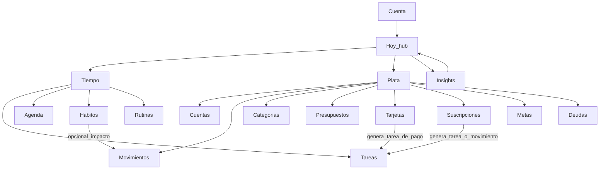
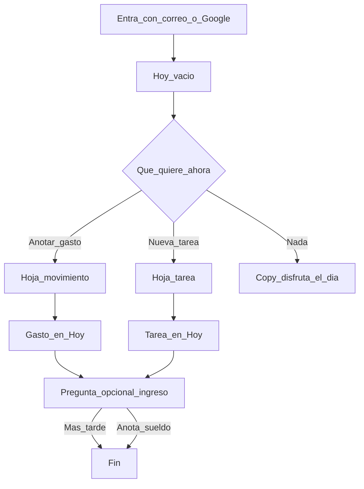
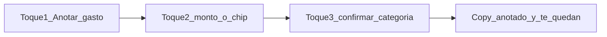
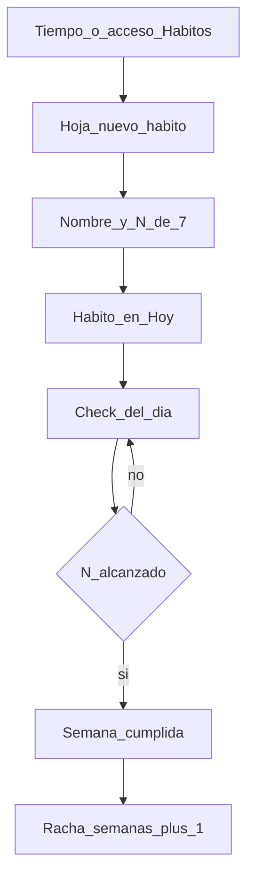
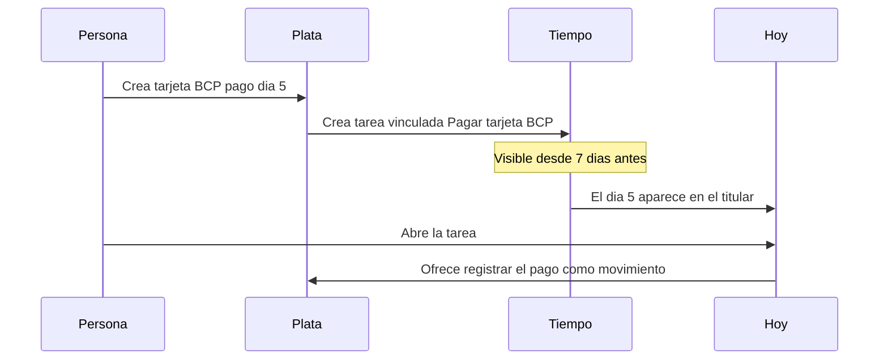
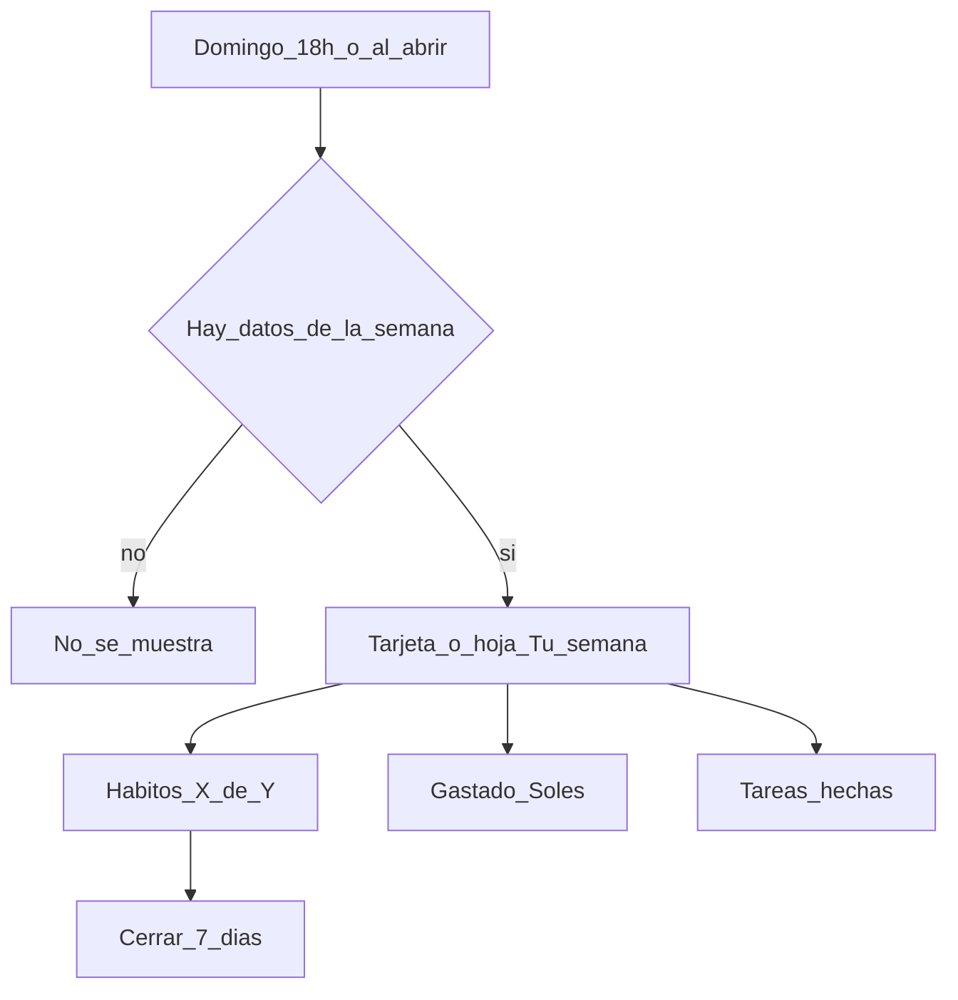
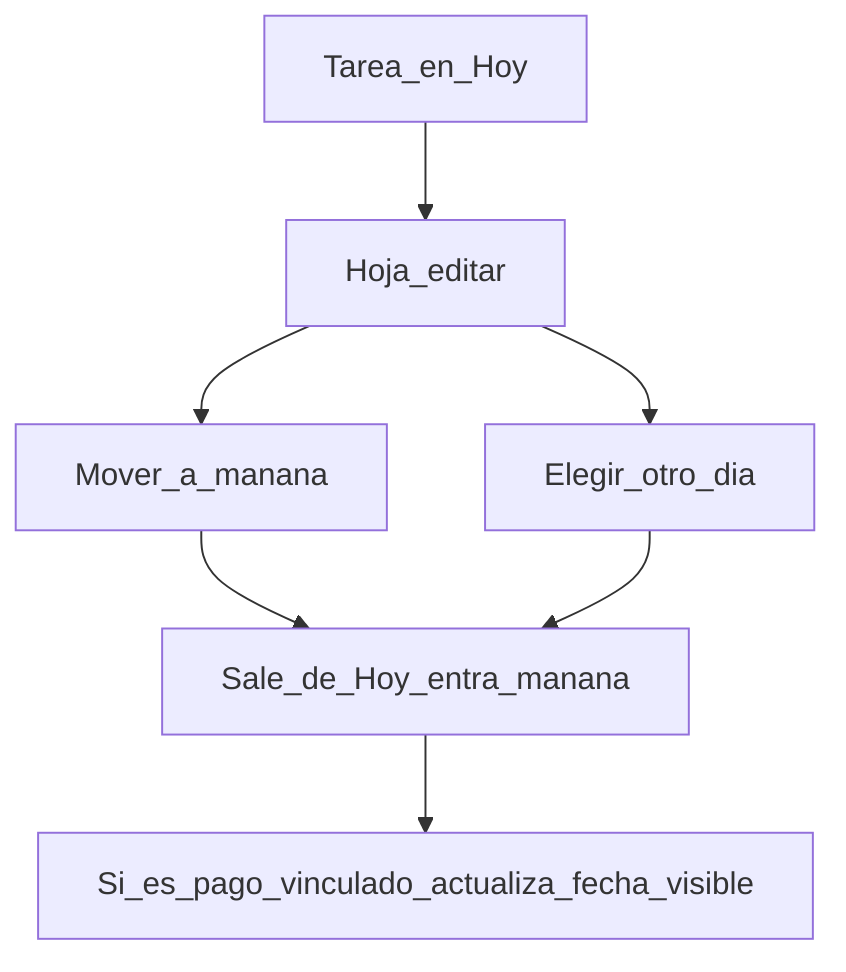
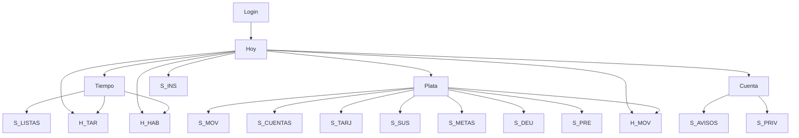
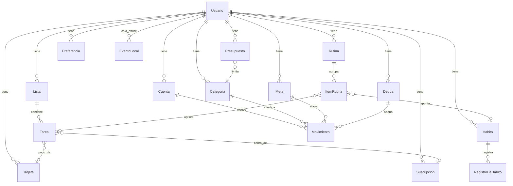

# Especificación de producto de RUMBO

Versión 1.0 · Octubre 2026 · Insumos: [`../marca/manual-de-marca.md`](../marca/manual-de-marca.md), [`../marca/tokens.css`](../marca/tokens.css)

Este documento define **qué hace Rumbo**, no cómo se programa. Vocabulario y tono: glosario y microcopy del manual (secciones 4.3 a 4.5). Nombres de secciones: **Hoy**, **Tiempo**, **Plata**. Nunca "dashboard", "finance" ni "habits" en la interfaz.

## 0. Supuestos de esta versión

El prompt pedía hasta 5 preguntas. No las hice en chat porque pediste ejecutar; declaré estas respuestas. Si alguna cambia, se tocan las secciones indicadas.

| Decisión | Asunción | Qué condiciona |
| --- | --- | --- |
| Monetización | Gratis y sin anuncios. Sin plan de pago en el alcance. | Métricas, Cuenta, mensajes. No hay paywall ni "Pro". |
| Cuentas compartidas | Individual. Pareja / hogar en v2. | Modelo de datos, privacidad, Insights. |
| Alcance del MVP de Plata | Empieza por **movimientos + "te queda" + una cuenta**. Tarjetas, presupuestos por categoría, metas y deudas van en v1. | MoSCoW, backlog, onboarding. |
| Fecha de lanzamiento | Sin fecha fija. El MVP sale cuando se valida la hipótesis "tiempo + plata en un vistazo". | Roadmap por hipótesis, no por calendario. |
| Offline | Must. Registrar tarea, hábito y gasto sin señal; sincronizar después. | Diego, PWA, conflictos, copy de error. |

Supuestos extra:

- Mercado inicial Perú (`es_PE`, S/). Dólares como segunda moneda desde v1 (Camila). En MVP, un movimiento puede marcarse en USD y se guarda el monto + tipo de cambio que la persona escribe.
- Lo que ya existe se conserva y se redibuja: login correo/Google, Hoy, Semana, Listas, tareas con hora y aviso, PWA instalable.
- Conflicto con el manual: el valor "registrar en menos de 5 segundos" es más agresivo que el ejemplo del prompt ("10 segundos / 3 toques"). **Gana el manual:** gasto en ≤ 5 s y ≤ 3 toques.
- Las 3 decisiones de marca abiertas (gasto sin rojo, verde = marca e ingreso, cercanía con Allpa) no bloquean esta spec. El producto las implementa como propone el manual hasta que se validen.

Personas citadas en todo el documento: **Valeria** (oficina), **Diego** (campo, 14x7), **Camila** (híbrida/freelance). Ver manual §2.

---

## 1. Visión de producto y principios

### Visión

Que una persona ocupada abra Rumbo en 10 segundos y sepa cómo va su día y su plata, y qué hacer ahora.

### North Star Metric

**% de usuarios activos semanales que en la misma semana registraron al menos 1 tarea (o hábito) y 1 movimiento.**

Justificación: el territorio de marca es el cruce tiempo + plata. Usuarios que solo anotan tareas son "Hoy viejo". Usuarios que solo anotan gastos son otra app de finanzas. El norte es gente que usa **ambos** dominios en el mismo vistazo.

Métrica de apoyo (más sensible semana a semana): **número de "vistazos de Hoy" con ambos bloques con dato** (tareas/hábitos del día + disponible del mes).

### Principios de producto / UX

| # | Principio | Cómo se mide |
| --- | --- | --- |
| P1 | **Registro en 5 segundos.** Anotar un gasto o una tarea toma ≤ 5 s y ≤ 3 toques desde Hoy. | Percentil 75 del tiempo entre abrir la hoja y guardar. Si pasa de 5 s, se rediseña. |
| P2 | **Valor el primer día, sin configurar.** Tras entrar, en ≤ 2 min la persona tiene una tarea o un gasto en Hoy. No pedimos cuentas, presupuestos ni hábitos antes. | % de nuevos que crean 1 ítem en los primeros 2 min. |
| P3 | **Cada pantalla responde "¿qué hago ahora?"** Hoy = estado + 1 acción. Tiempo = esta semana. Plata = cuánto te queda. | Prueba de 5 segundos: 4 de 5 personas dicen la pregunta correcta. |
| P4 | **Nunca castigamos.** Una racha rota es un reinicio amable. Un gasto no se pinta de rojo. El único granate es "te pasaste del presupuesto que tú pusiste". | 0 strings con "perdiste", "fracaso", "deberías". Hábitos: semana 5 de 7 = cumplida. |
| P5 | **Offline primero.** Tarea, hábito y gasto se guardan sin señal y no se pierde el dato. | 0 pérdidas reportadas; Diego puede usarlo un turno completo. |
| P6 | **Máximo 2 avisos automáticos al día.** El horario lo elige la persona. Todo lo demás es silencio. | Media de pushes/usuario/día ≤ 2. |
| P7 | **Una tarjeta oscura por pantalla.** El anillo o el número grande es lo único que "grita". | Revisión de diseño: ≤ 1 bloque Noche Bosque por vista. |
| P8 | **El cruce se ve, no se configura.** La cuota de la tarjeta aparece como tarea. El resumen semanal junta tiempo y plata. Nadie arma un "sistema". | En v1, 100 % de las tarjetas con fecha de pago generan una tarea vinculada. |

### Qué no es Rumbo (anti-alcance)

- Un banco, una billetera ni un neobanco. No mueve plata.
- Una app que se conecta sola a tu banco (no en MVP ni v1).
- Un GTD, un kanban, un Notion ni un segundo cerebro.
- Un calendario laboral (Google Calendar del trabajo se queda donde está).
- Un coach, un reto social ni un ranking.
- Una app de inversiones, impuestos, facturación electrónica o contabilidad para Camila-empresa.
- Una app de pareja / presupuesto familiar (v2).
- Un recetario, un tracker de calorías, un pomodoro o un diario emocional.

---

## 2. Mapa de módulos



### Hoy (hub del día)

Propósito: responder en un vistazo "¿cómo va mi día?" y "¿cuánto me queda?". Persona primaria: las tres, cada mañana. Conecta Tiempo (tareas y hábitos de hoy) y Plata (disponible del mes). Es la pantalla que justifica el nombre.

### Tiempo (organización)

Propósito: tareas de una vez, agenda de la semana, hábitos con racha semanal y rutinas (grupos). Sirve más a Valeria (día cargado) y Diego (hábitos que sobrevivan el 14x7). Conecta con Plata cuando un pago o una suscripción se vuelve tarea.

### Plata (finanzas)

Propósito: saber en qué se va la plata y cuánto queda, sin sentirse un banco. Sirve más a Valeria (el sueldo desaparece) y Camila (ingresos irregulares). Diego lo usa offline en turno y lo revisa en franco. Conecta con Tiempo por tareas de pago y con Insights por el resumen semanal.

### Insights

Propósito: una vez por semana (y a fin de mes) cruzar tiempo y plata: "esta semana hiciste 12 de 14 hábitos y gastaste S/ 420". No es una pestaña. Vive como hoja o como bloque en Hoy el domingo / lunes. Sirve a Diego en el franco y a Camila el domingo.

### Cuenta

Propósito: perfil, moneda, avisos, privacidad, exportar y borrar. Sirve a las tres; Diego necesita "funciona sin señal" visible; Camila necesita dólares.

---

## 3. Detalle por módulo

Convención de historias: persona del manual. Criterios en Given / When / Then.

### 3.1 Hoy

#### Historias

**H-HOY-1.** Como Valeria, quiero ver al abrir la app un titular que resuma mi día y mi plata para saber si estoy al día en 10 segundos.

- Given que hoy tiene 3 tareas abiertas y un disponible de S/ 640
- When abre Hoy
- Then el titular en dos tonos dice "Te quedan 3 cosas / y S/ 640 este mes" (o equivalente del glosario, nunca "dashboard")

**H-HOY-2.** Como Diego, quiero tres accesos rápidos (anotar gasto, nueva tarea, marcar hábito) para actuar en un hueco de 30 segundos.

- Given está en Hoy, con o sin señal
- When toca "Anotar gasto"
- Then se abre la hoja de movimiento, no una pantalla nueva

**H-HOY-3.** Como Camila, quiero una tarjeta oscura con anillo (hábitos de la semana o disponible del mes) para sentir avance, no lista infinita.

- Given hay al menos un hábito o un presupuesto
- When mira Hoy
- Then hay **una** tarjeta Noche Bosque. Si no hay dato de plata todavía, el anillo es hábitos de la semana. Si no hay hábitos, es "tareas hechas hoy".

**H-HOY-4.** Como Valeria, quiero un carrusel "Para ti" con un Recuerda / Tip / Logro que pueda cerrar, para que la app me hable como amiga y no como sistema.

- Given hay una tarjeta editorial
- When toca la X
- Then desaparece 7 días y no vuelve la misma

#### Reglas

- El titular tiene dos líneas. Línea 1 (apagada) = contexto. Línea 2 (negrita) = el dato. Prioridad: (1) algo vence hoy, (2) tareas abiertas + disponible, (3) "Todo listo, / no tienes nada pendiente".
- Disponible del mes (MVP): `ingresos_del_mes − gastos_del_mes`. Si no hay ingresos registrados, no inventamos el sueldo: el titular habla solo de tiempo y el bloque de plata dice "Anota tu último ingreso para ver cuánto te queda".
- Disponible del mes (v1, con presupuesto): `suma de topes de categorías − gastado en esas categorías`. Ejemplo: Comida S/ 800, Transporte S/ 200, Salidas S/ 300 = tope S/ 1,300. Gastó S/ 820 → "Te quedan S/ 480".
- Máximo 3 accesos rápidos. Orden por defecto: Anotar gasto, Nueva tarea, Hábitos. No se personalizan en el MVP.
- Semana en chips: lun–vie visibles; sáb–dom en el swipe o en Tiempo. Chip de hoy con borde Verde Rumbo. Día cumplido (todas las tareas hechas) en Verde Bruma.

#### Estados

| Estado | Microcopy |
| --- | --- |
| Vacío (día 1, sin nada) | "Nada pendiente por ahora. Agrega algo o disfruta el día." |
| Cargando | Esqueleto de titular + 3 círculos + tarjeta oscura. Sin spinner de página. |
| Error | "No pudimos actualizar. Lo que ves es lo último que se guardó." + reintentar |
| Sin conexión | Badge "Sin señal" en la píldora de fecha. Todo lo demás usable. |
| Éxito (día limpio) | "Todo listo, / no tienes nada pendiente." Humor permitido: "Disfruta el lujo." |

#### Notificaciones

Ninguna propia de Hoy. Los avisos salen de Tareas, Hábitos y Plata. Hoy solo **muestra** lo que esos módulos programaron.

#### Atajos

- FAB o botón central de la tab bar no existe (rompe la tab bar de 4). La captura vive en el grid de 3.
- Lenguaje natural en la hoja de tarea: "pagar luz mañana 6pm" → título Pagar luz, fecha mañana, hora 18:00. MVP: fecha y hora si el texto las trae; si no, hoy sin hora.

---

### 3.2 Tiempo — Tareas

Existe hoy. Se conserva y se alinea a marca.

#### Historias

**H-TAR-1.** Como Valeria, quiero crear una tarea con título, día y hora opcional para que me avise cuando el Metropolitano no alcanza.

- Given abre la hoja "Nueva tarea"
- When guarda "Llamar al banco" mañana 9:00
- Then ve "Listo, tarea guardada para mañana a las 9:00." y la tarea aparece en Hoy mañana

**H-TAR-2.** Como Diego, quiero marcar una tarea hecha sin señal para no perder el avance del turno.

- Given no hay red
- When marca la tarea
- Then el check queda y se sincroniza al volver la señal

**H-TAR-3.** Como Camila, quiero listas (Trabajo, Personal) para no mezclar clientes con la casa.

- Given tiene 2 listas
- When crea "Enviar cotización" en Trabajo
- Then no aparece en Personal; sí en Hoy si es para hoy

**H-TAR-4.** Como Valeria, quiero reprogramar una tarea en 2 toques cuando se me pasó el día.

- Given una tarea vencida
- When toca "Mover a mañana"
- Then cambia de día y no se marca como fracaso

#### Reglas

- Una tarea es de una vez. Si se repite, es hábito o suscripción, no tarea recurrente compleja en el MVP.
- Tarea vinculada a un pago (v1): no se puede borrar sin confirmar; al marcarla hecha no registra el movimiento sola (la persona confirma el monto en la hoja).
- Orden por defecto: hora, luego manual. Las vencidas ayer suben con etiqueta "Ayer", sin rojo de alarma.
- Recordatorio: si tiene hora, un aviso 0 min antes (o 15 min si la persona lo eligió). Cuenta para el cupo de 2/día: si ya hubo 2, este se agrupa en "Tienes 3 avisos" a la hora más temprana.

#### Estados

| Estado | Microcopy |
| --- | --- |
| Vacío (lista) | "Esta lista está en calma. Agrega una tarea cuando quieras." |
| Vacío (Hoy) | Ver 3.1 |
| Error al guardar | "No pudimos guardar. Lo intentamos de nuevo cuando vuelva la señal; no pierdes nada." |

#### Notificaciones

- Push: "Buenos días, Valeria. Hoy tienes 3 tareas y pagas Netflix." (solo si hay ≥1 tarea hoy; máx. 1 saludo matutino)
- Push puntual: título de la tarea a la hora. Texto corto, sin emoji de fuego.

#### Atajos

- Hoja inferior, no página. Título, día (chips), hora (opcional), lista (opcional).
- "pagar luz mañana 6pm" como arriba.

---

### 3.3 Tiempo — Agenda / Semana

La vista Semana actual se convierte en la agenda de Tiempo.

#### Historias

**H-AGE-1.** Como Valeria, quiero ver lun–vie con chips y el detalle del día para planear la semana en 1 minuto el domingo.

- Given la semana tiene tareas
- When abre Tiempo
- Then ve chips (día, número, estado) y al tocar un día, sus tareas

**H-AGE-2.** Como Diego, quiero un modo 14x7 (v1) para que los hábitos no me pidan check los 14 días de mina si yo los definí solo en franco.

- Given su hábito "Correr" es "en franco, 3 de 4 días"
- When está en turno
- Then Hoy no lo culpa; el chip no se pone granate

#### Reglas

- MVP: semana calendario (lun–dom), sin turnos. Diego usa la racha 5 de 7.
- v1: etiqueta de período "En turno / En franco" opcional en Cuenta; los hábitos pueden anclarse a franco.
- Un día "listo" = todas las tareas de ese día hechas. Los hábitos no bloquean el chip.

---

### 3.4 Tiempo — Hábitos

#### Historias

**H-HAB-1.** Como Valeria, quiero un hábito "Gimnasio, 3 de 7" para que una semana con 3 idas cuente como cumplida.

- Given crea hábito Gimnasio, meta 3/7
- When marca 3 días
- Then "Hecho. Gimnasio 3 de 4 esta semana." al tercer check, y al cierre semanal "Semana cumplida" si ≥ 3

**H-HAB-2.** Como Diego, quiero que fallar un día no borre la racha de semanas.

- Given lleva 3 semanas cumplidas y esta semana va 1 de 3
- When no marca el martes
- Then la racha de **semanas** sigue en 3 hasta el domingo. Si el domingo cierra < 3, la racha de semanas vuelve a 0 con copy: "Esta semana no se cerró. La próxima cuenta igual."

**H-HAB-3.** Como Camila, quiero un recordatorio a una hora para el hábito de leer, sin que me escriban 7 veces.

- Given aviso 21:30, 1 vez al día
- When ya recibió 1 push de hábitos hoy
- Then no sale otro; el de la mañana de tareas sí puede salir (cupo 2)

#### Reglas

- Frecuencia = "quiero N de 7 días" (default 5 de 7, el número de la marca). No hay "todos los días o perdiste".
- Racha = semanas seguidas con N cumplido. No es racha diaria.
- Un check es del día local de la persona (`America/Lima`). No se puede marcar el futuro. Se puede desmarcar hoy.
- v1: hábito con impacto opcional (ej. "Café en casa" sugiere un gasto evitado). No automático.
- Máximo 7 hábitos activos en MVP (claridad). El 8.º pide archivar uno.

#### Estados

| Estado | Microcopy |
| --- | --- |
| Vacío | "Un hábito a la vez. Empieza con algo de 2 minutos." |
| Semana a medias | "Gimnasio 2 de 3. Aún estás a tiempo." |
| Semana no cerrada | "Esta semana no se cerró. La próxima cuenta igual." |

#### Notificaciones

- 1 recordatorio por hábito como máximo, y el sistema agrupa: "Hoy: gimnasio y leer." Cuenta 1 del cupo.
- Nunca "rompiste la racha".

---

### 3.5 Tiempo — Rutinas

v1. Grupo de hábitos/tareas en un momento ("Rutina de mañana": agua, 10 min de orden, anotar el gasto de ayer).

**H-RUT-1.** Como Valeria, quiero marcar la rutina de mañana en un toque para no abrir 3 hábitos.

- Given la rutina tiene 3 ítems
- When toca "Hecho"
- Then los 3 se marcan hoy; puede desmarcar uno suelto después

Regla: una rutina no crea lógica nueva de racha; cada ítem sigue su hábito.

---

### 3.6 Plata — Cuentas y movimientos

#### Historias

**H-MOV-1.** Como Valeria, quiero anotar un gasto en 3 toques: monto, categoría, listo.

- Given está en Hoy
- When toca Anotar gasto, escribe 18.50, acepta "Almuerzo"
- Then "S/ 18.50 en Almuerzo. Te quedan S/ 312 en Comida este mes." (si hay presupuesto; si no: "Anotado. Llevas S/ 96 en almuerzos esta semana.")

**H-MOV-2.** Como Diego, quiero guardar el gasto sin señal.

- Given sin red
- When guarda S/ 12 en Yape (cuenta efectivo/billetera)
- Then queda en el dispositivo y se sube al volver

**H-MOV-3.** Como Camila, quiero registrar un ingreso en dólares.

- Given moneda del movimiento = USD
- When anota 150 y tipo de cambio 3.80
- Then se guarda USD 150 y S/ 570 para los totales del mes. En la lista se ve "USD 150 · S/ 570"

**H-MOV-4.** Como Valeria, quiero una transferencia entre Efectivo y BCP que no cuente como gasto.

- Given dos cuentas
- When transfiere S/ 200
- Then el disponible del mes no cambia; cada cuenta sí

#### Reglas

- Tipos de movimiento: **gasto**, **ingreso**, **transferencia**. Palabra en UI: esas tres. Nunca "egreso".
- Un movimiento pertenece a **una** cuenta (la transferencia es un par interno: salida + entrada, un solo evento de usuario).
- Categoría obligatoria en gasto e ingreso; sugerida por último uso / hora (13:40 → Almuerzo).
- Monto > 0. Máximo 2 decimales. Formato: `S/ 1,250.00`.
- Gasto en listas: Tinta Bosque + signo "−". Ciruela solo en gráficos y en el ícono de categoría. (Decisión de marca abierta; se implementa así.)
- Ingreso: Verde Rumbo + "+".
- Disponible MVP: ver 3.1. Ejemplo: ingresos octubre S/ 4,800; gastos S/ 3,210 → **S/ 1,590**.
- Categorías iniciales (se pueden renombrar): Almuerzo, Comida, Transporte, Yape/transferencias, Casa, Salud, Salidas, Suscripciones, Trabajo (Camila), Otros.
- Cuentas iniciales al primer movimiento: **Efectivo / Yape / Plin** (una sola, "Billetera") y opcional "Banco". No pedimos 5 cuentas el día 1.
- Editar/borrar movimiento: hasta 90 días. Borrar no usa la palabra "eliminar registro contable".

#### Estados

| Estado | Microcopy |
| --- | --- |
| Vacío | "Aún no registras nada este mes. Empieza con lo último que gastaste." |
| Error de monto | "Ese monto no parece correcto. Usa solo números, por ejemplo 25.50." |
| Sin conexión | Igual que Hoy; el gasto se guarda local |

#### Notificaciones

- Opcional, 21:30, 1 vez: "¿Qué gastaste hoy? Anótalo en 5 segundos." Off por defecto. Si ya anotó un gasto hoy, no sale.
- Nunca un push por cada gasto.

#### Atajos (3 toques)

1. Tocar "Anotar gasto"
2. Monto (teclado numérico grande; últimos 3 montos como chips: 12, 18.50, 25)
3. Confirmar categoría sugerida (o cambiarla en el mismo toque largo / segundo tap)

Toque 0 = el acceso. No hay "tipo de movimiento" en el camino feliz: el default es gasto. Ingreso es un switch en la misma hoja.

---

### 3.7 Plata — Presupuestos (v1)

**H-PRE-1.** Como Valeria, quiero un tope de S/ 800 en Comida para ver "S/ 820 de S/ 800" y un aviso honesto, no un sermón.

- Given tope Comida S/ 800 y gastó S/ 840
- When abre Plata o recibe el aviso
- Then "Te pasaste S/ 40 en Comida. Puedes mover plata de otra categoría o ajustar el límite." Granate en la barra, no en cada gasto.

Regla: el presupuesto es mensual por categoría, se reinicia el 1. El "disponible" global (v1) = suma de topes − gastado en categorías con tope. Categorías sin tope no entran al anillo.

---

### 3.8 Plata — Tarjetas y suscripciones (v1)

**H-TARJ-1.** Como Valeria, quiero registrar mi Visa BCP (límite S/ 5,000, corte 15, pago 5, usado S/ 1,200) para ver la fecha de pago como tarea.

- Given guarda la tarjeta con pago el 5
- When llega el 4 (o el 5, según aviso)
- Then existe una tarea "Pagar tarjeta BCP" ese día, vinculada, no duplicable a mano

**H-SUS-1.** Como Valeria, quiero Netflix S/ 44.90 cada 18 para no olvidarlo y verlo en suscripciones.

- Given suscripción activa
- When llega el 18
- Then tarea "Netflix S/ 44.90" y, al marcarla, la hoja ofrece registrar el gasto (monto precargado)

Reglas:

- Usado + disponible = límite. Ejemplo: límite 5,000, usado 1,200 → disponible S/ 3,800.
- Pago mínimo es informativo; Rumbo no calcula intereses.
- La tarea de pago se crea 7 días antes y se muestra en Hoy el día D. Si se paga antes, se marca y no vuelve ese mes.
- Suscripción ≠ hábito. Es plata que sale sola.

---

### 3.9 Plata — Metas y deudas (v1)

**H-MET-1.** Como Diego, quiero una meta "Inicial de la casa, S/ 15,000 para diciembre" con anillo.

- Given lleva S/ 7,500
- When abre la meta
- Then anillo 50 % y "Llegaste al 50 % de tu meta. La mitad del camino ya es tuya."

**H-DEU-1.** Como Camila, quiero anotar "Me deben USD 200" y "Debo S/ 800 de la laptop" para no mezclarlo con el mes.

Regla: abonar a una meta es un movimiento tipo transferencia a la cuenta/meta, no un gasto. Ejemplo: de Billetera a Meta Casa S/ 500 → disponible del mes baja solo si ese 500 era parte del presupuesto de ahorro; si la meta está fuera del presupuesto, es transferencia.

Deuda "me deben" no suma al disponible hasta que se registra el ingreso.

---

### 3.10 Insights

**H-INS-1.** Como Diego, quiero el domingo (o el primer franco) un resumen: hábitos 12/14, gastado S/ 420, tareas 8/10.

- Given la semana cerró
- When abre Hoy
- Then aparece una tarjeta editorial "Tu semana" o una hoja una vez. Se puede cerrar.

**H-INS-2.** Como Camila, quiero ver ingresos esperados vs. reales (v1) para bajar la ansiedad.

Regla: Insights no pide configuración. Se calcula con lo ya registrado. Si no hay plata, el resumen es solo tiempo.

Notificaciones: 1 semanal opcional, domingo 18:00, off por defecto. "Tu semana: 5 de 7 hábitos y S/ 420. ¿La vemos?"

---

### 3.11 Cuenta

**H-CUE-1.** Como Valeria, quiero ver mi nombre, foto, badges (moneda S/, "Sin anuncios") y acciones: datos, avisos, exportar, salir.

**H-CUE-2.** Como Diego, quiero un PIN o biometría para abrir Plata (y opcional toda la app).

**H-CUE-3.** Como Camila, quiero exportar mis datos y borrar la cuenta en un flujo claro.

**H-CUE-4.** Como las tres, quiero elegir moneda principal (S/) y si acepto USD, más el tope de 2 avisos y sus horarios.

Reglas:

- Exportar: un archivo con tareas, hábitos y movimientos (formato simple, no "dump SQL").
- Borrar cuenta: confirmación con escribir "borrar"; 7 días de gracia si hay servidor; en el cliente se limpia al toque.
- Qué nunca se envía a terceros: movimientos, montos, nombres de cuentas. Analítica solo eventos de producto (sección 7), sin montos.

---

## 4. Flujos clave

### 4.1 Onboarding del primer día (≤ 2 min)



No pedimos categorías, presupuestos, hábitos ni notificaciones en este flujo. El permiso de avisos se pide la **primera vez que una tarea tiene hora**, no al entrar.

### 4.2 Registrar un gasto en 3 toques



### 4.3 Crear un hábito y cerrar la semana



### 4.4 Tarjeta de crédito → tarea de pago (v1)



### 4.5 Resumen semanal



### 4.6 Reprogramar tarea o pago



Un pago de tarjeta reprogramado no cambia la fecha de pago del banco; solo la tarea. Copy: "La movimos de día en Rumbo. La fecha del banco sigue igual."

---

## 5. Inventario de pantallas y navegación

### 5.1 Tab bar (4 pestañas)

Cuatro, no cinco. P5 (Insights) como pestaña viola P3 y P7: Insights no es un destino diario.

| Tab | Nombre | Ícono Tabler | Contenido | Por qué |
| --- | --- | --- | --- | --- |
| 1 | Hoy | `home` | Hub del día | La promesa. Activa = píldora Verde Impulso + texto. |
| 2 | Tiempo | `calendar` | Semana, listas, hábitos | Un solo lugar para lo que se **hace**. |
| 3 | Plata | `wallet` | Disponible, movimientos, (v1) resto | Un solo lugar para la plata. |
| 4 | Cuenta | `user` | Perfil y ajustes | Igual que la referencia estructural. |

Inactivas: solo ícono en Luna sobre Noche Bosque. Altura 64 px, flotante, inset 16 px.

### 5.2 Pantallas y hojas

| ID | Ruta | Objetivo | Componentes de referencia | Datos | Acciones |
| --- | --- | --- | --- | --- | --- |
| S-LOGIN | `/entrar` | Entrar | Titular grande, CTA Verde Rumbo | — | Correo, Google |
| S-HOY | `/hoy` | Vistazo del día | Saludo + fecha, titular 2 tonos, carrusel, grid 3, tarjeta oscura + anillo, chips semana | Tareas hoy, hábitos hoy, disponible | Accesos, check, abrir hoja |
| S-TIEMPO | `/tiempo` | Semana y hábitos | Chips semana, lista de tareas del día, fila de hábitos | Semana, hábitos | Cambiar día, check, nueva tarea/hábito |
| S-LISTAS | `/tiempo/listas` | Listas | Filas tipo list-link | Listas y conteos | Abrir lista |
| S-LISTA | `/tiempo/listas/:id` | Tareas de una lista | Filas, vacío | Tareas | Crear, editar |
| S-PLATA | `/plata` | Cuánto queda | Titular 2 tonos o tarjeta oscura + anillo, barra "S/ X de S/ Y", lista de movimientos | Disponible, últimos movimientos | Anotar, abrir detalle |
| S-MOV | `/plata/movimientos` | Historial del mes | Lista, chips de filtro | Movimientos | Editar, filtrar |
| S-CUENTAS | `/plata/cuentas` | Saldos | Grid / filas | Cuentas | Crear cuenta (v1 más tipos) |
| S-TARJ | `/plata/tarjetas` | Líneas y fechas | Tarjeta oscura por tarjeta | Límite, usado, fechas | Crear, editar |
| S-SUS | `/plata/suscripciones` | Cobros que se repiten | Filas + monto | Suscripciones | Crear, pausar |
| S-METAS | `/plata/metas` | Avance | Anillo por meta | Metas | Abonar, crear |
| S-DEU | `/plata/deudas` | Debo / me deben | Dos bloques | Deudas | Abonar |
| S-PRE | `/plata/presupuestos` | Topes del mes | Barras por categoría | Presupuestos | Ajustar tope |
| S-INS | hoja `/hoy?semana=1` | Resumen semanal | Carrusel o hoja | Agregados | Cerrar |
| S-CUENTA | `/cuenta` | Identidad y control | Gradiente suave, avatar, badges, grid 3 | Nombre, tel. opcional, moneda | Datos, avisos, exportar |
| S-AVISOS | `/cuenta/avisos` | Cupo y horarios | Toggles | Prefs | On/off |
| S-PRIV | `/cuenta/privacidad` | PIN, exportar, borrar | Texto claro | — | Exportar, borrar |
| H-TAR | hoja | Crear/editar tarea | Bottom sheet | Campos cortos | Guardar |
| H-MOV | hoja | Crear/editar movimiento | Bottom sheet, teclado monto | Monto, categoría, cuenta | Guardar |
| H-HAB | hoja | Crear hábito | Bottom sheet | Nombre, N/7 | Guardar |
| H-PAGO | hoja | Confirmar pago de tarjeta | Bottom sheet | Monto precargado | Registrar movimiento |

Pantallas v1: S-TARJ, S-SUS, S-METAS, S-DEU, S-PRE, rutinas, 14x7. MVP: login, Hoy, Tiempo (semana + listas + hábitos simples), Plata (disponible + movimientos + 1–2 cuentas), Cuenta (perfil, avisos, exportar/borrar básico).

### 5.3 Mapa de navegación



### 5.4 Wireframes ASCII

**Hoy**

```
[ Hola, Valeria ]              [ Dom. 4 oct. ]
todo en orden
Te quedan 3 cosas
y S/ 640 este mes

[ Recuerda                    X ]
  Mañana vence la BCP
  Puedes pagar desde Plata

[ $ Anotar ] [ + Tarea ] [ o Hábito ]

[ TU SEMANA              4 de 5 ]
[  (anillo)   hábitos           ]

LUN  MAR  MIE  JUE  VIE
 5    6    7    8    9
ok   ok   hoy

( tab: Hoy | Tiempo | Plata | Cuenta )
```

**Tiempo**

```
Tu semana
está completa          5 de 5 listos

Lo que pediste              5 días
Lun 5  Trigo / ...     [Reprogramar]
Mar 6  ...             [Reprogramar]

Hábitos
Gimnasio    ooo..  3 de 7
Leer        oooo.  4 de 7

( tab Tiempo activa )
```

**Plata**

```
Te quedan
S/ 1,590 este mes

[ Envios / anillo opcional ]

Almuerzo          − S/ 18.50
Yape              − S/ 40.00
Cliente A         + S/ 800.00

( tab Plata activa )
```

**Hoja Anotar gasto**

```
        ____ hoja ____
Anotar gasto          [X]
     S/  18.50
 [12] [18.50] [25]
Categoría  Almuerzo  v
Cuenta     Billetera v
         [ Listo ]
```

**Cuenta**

```
        (gradiente suave)
           (avatar)
        Valeria Soto
        +51 9...
 [ S/ soles ]  [ Sin anuncios ]

[ Editar ] [ Avisos ] [ Exportar ]

Tus datos                    Editar
```

---

## 6. Priorización y roadmap

### 6.1 MoSCoW

| Función | Prioridad | Fase | Personas |
| --- | --- | --- | --- |
| Login correo / Google | Must | Existe | Las 3 |
| Hoy: titular, grid 3, chips | Must | MVP | Las 3 |
| Tareas + listas + hora + aviso | Must | Existe → redibujar | Valeria, Camila |
| Hábitos N de 7 + racha semanal | Must | MVP | Valeria, Diego |
| Movimiento gasto/ingreso | Must | MVP | Las 3 |
| Disponible = ingresos − gastos | Must | MVP | Valeria, Camila |
| Offline local + sync | Must | MVP | Diego |
| PWA instalable | Must | Existe | Diego, Valeria |
| Hoja de captura (no página) | Must | MVP | Las 3 |
| Cuenta: avisos, exportar, borrar | Must | MVP | Las 3 |
| 1–2 cuentas (Billetera, Banco) | Must | MVP | Las 3 |
| Transferencia entre cuentas | Should | v1 | Camila |
| Presupuesto por categoría | Should | v1 | Valeria |
| Tarjeta + tarea de pago | Should | v1 | Valeria |
| Suscripciones | Should | v1 | Valeria |
| Metas con anillo | Should | v1 | Diego |
| Deudas debo / me deben | Should | v1 | Camila |
| USD + tipo de cambio | Should | v1 | Camila |
| Insights semanal | Should | v1 | Diego, Camila |
| Rutinas | Should | v1 | Valeria |
| PIN / biometría | Should | v1 | Diego |
| Calendario 14x7 | Could | v2 | Diego |
| Importar foto / texto de movimiento | Could | v2 | Valeria |
| Widget de gasto | Could | v2 | Valeria |
| Compartir meta con pareja | Could | v2 | Diego |
| Conexión bancaria | Could | v2+ | Valeria |
| Cuentas de trabajo vs personal | Could | v2 | Camila |
| Temas / modo oscuro | Could | v2 | — |
| Recurrencia compleja de tareas | Won't | — | — |
| Inversiones, impuestos, e-facturas | Won't | — | — |
| Red social / ranking | Won't | — | — |
| Chat con IA coach | Won't | — | — |

### 6.2 Fases

**MVP — "El vistazo existe"**

- Redibujar Hoy / Tiempo / Cuenta con tokens y patrones.
- Hábitos simples (N de 7, racha semanal).
- Plata mínima: movimientos + disponible + 1–2 cuentas.
- Offline para tarea, hábito y movimiento.
- Criterio de salida: 15 beta (mezcla de las 3 personas) usan **ambos** dominios ≥ 2 semanas; p75 de registro de gasto ≤ 5 s; 0 pérdidas offline reportadas.

Hipótesis: *si Hoy muestra tiempo y plata juntos y el gasto sale en 3 toques, la gente deja la libreta y no abre una segunda app.* Medición: North Star en la beta.

**v1 — "La plata es completa y se cruza"**

- Presupuestos, tarjetas → tarea, suscripciones, metas, deudas, USD, insights, PIN, rutinas, transferencias.
- Criterio de salida: ≥ 40 % de activos semanales usan ambos dominios; ≥ 30 % de quienes tienen tarjeta tienen la tarea de pago; insights abierto ≥ 25 % los domingos.

Hipótesis: *el cruce (pago = tarea) es la razón para quedarse, no la lista de features.* Medición: retención D30 de usuarios con ≥ 1 tarjeta vs. solo movimientos.

**v2 — "Cabe en la vida real de Perú"**

- 14x7, importación, widget, pareja, trabajo vs personal, banco (si hay proveedor).
- Criterio de salida: Diego puede definir franco; Camila separa trabajo; importar no es el camino feliz (sigue siendo el registro de 5 s).

Hipótesis: *sin banco conectado igual retienen si el registro es más rápido que abrir Yape y olvidar.* Medición: movimientos/semana no caen al ofrecer importar.

---

## 7. Métricas de producto

| Métrica | Definición | Meta inicial (beta 8 semanas) |
| --- | --- | --- |
| Activación (aha) | En los primeros 7 días: ≥ 1 tarea **y** ≥ 1 movimiento | ≥ 50 % de registros |
| Retención D1 | Volvió al día siguiente | ≥ 40 % |
| Retención D7 | Volvió el día 7 o usó 3+ días de 7 | ≥ 25 % |
| Retención D30 | Semana 4 con ≥ 1 sesión | ≥ 15 % |
| Hábitos / usuario activo / semana | Checks de hábito / WAU | ≥ 4 |
| Movimientos / usuario activo / semana | Gastos+ingresos / WAU | ≥ 5 |
| Dual-domain | WAU con tarea-o-hábito **y** movimiento | ≥ 35 % MVP, ≥ 40 % v1 |
| Instalación PWA | % de activos que tienen `display-mode: standalone` | ≥ 30 % (Diego empuja) |
| Avisos | % que tiene ≥ 1 aviso on; pushes/usuario/día | ≥ 40 % on; media ≤ 2 |

### Eventos de analítica

Sin montos, sin títulos libres de tareas (privacidad). Propiedades cortas.

| Evento | Cuándo | Propiedades |
| --- | --- | --- |
| `session_start` | Abre la app | `standalone`, `offline` |
| `signup_ok` | Registro o Google | `method` |
| `task_saved` | Crea/edita tarea | `has_time`, `source` (hoy/tiempo/hoja) |
| `task_done` | Check | `overdue` |
| `habit_created` | Alta | `n_of_7` |
| `habit_check` | Marca el día | `n_done`, `n_goal` |
| `habit_week_closed` | Domingo | `met`, `streak_weeks` |
| `movement_saved` | Guarda movimiento | `type` (gasto/ingreso/transfer), `offline`, `seconds_to_save` |
| `available_viewed` | Ve el disponible | `has_income` |
| `card_created` | Alta tarjeta | — |
| `pay_task_opened` | Abre tarea de pago | — |
| `insight_opened` | Abre resumen | `week` |
| `insight_dismissed` | Cierra | — |
| `pwa_installed` | Instala | — |
| `export_done` | Exporta | — |
| `account_deleted` | Borra | — |

---

## 8. Modelo de datos conceptual

Sin SQL. Cardinalidades en el diagrama.



| Entidad | Atributos principales |
| --- | --- |
| Usuario | id, nombre, email, tz (`America/Lima`), moneda_principal (`PEN`), acepta_usd, avatar |
| Lista | id, nombre, orden |
| Tarea | id, titulo, dia, hora?, hecha, lista_id, vinculada_tipo?, vinculada_id? |
| Habito | id, nombre, n_meta (de 7), hora_aviso?, activo |
| RegistroDeHabito | habito_id, fecha, hecho |
| Rutina | id, nombre, momento (mañana/tarde/noche) |
| ItemRutina | rutina_id, habito_id o plantilla de tarea |
| Cuenta | id, nombre, tipo (billetera/banco/efectivo/meta), moneda, saldo_informativo |
| Categoria | id, nombre, tipo (gasto/ingreso), color_suave, icono |
| Movimiento | id, tipo, monto, moneda, tipo_cambio?, cuenta_id, categoria_id?, fecha, nota?, par_transferencia_id? |
| Presupuesto | categoria_id, mes, tope_pen |
| Tarjeta | nombre, limite, usado, corte_dia, pago_dia, minimo? |
| Suscripcion | nombre, monto, moneda, cada_n_dias o dia_mes, proxima |
| Meta | nombre, tope, fecha, cuenta_asociada |
| Deuda | direccion (debo/me_deben), persona, monto, moneda, fecha? |
| Preferencia | avisos_on, hora_manana, hora_noche, pin_on, max_pushes=2 |
| EventoLocal | tipo, payload, creado, sync_estado |

### Integridad

- Un movimiento tiene una cuenta. Transferencia = dos movimientos ligados por `par_transferencia_id` que no suman al disponible.
- Borrar categoría: los movimientos pasan a "Otros"; no se borran.
- Borrar cuenta con movimientos: no se puede; se archiva.
- Una tarjeta con `pago_dia` tiene ≤ 1 tarea de pago abierta por período.
- Marcar la tarea de pago no crea el movimiento hasta confirmar en H-PAGO.
- Habito: un `RegistroDeHabito` por (hábito, fecha).
- Offline: el `EventoLocal` gana si el servidor no tiene una versión más nueva del mismo id; si hay conflicto de edición, gana el último `updated_at` del cliente y se avisa "Guardamos lo último que anotaste sin señal."

---

## 9. Riesgos y consideraciones

### Privacidad

- Datos de plata no van a analítica ni a terceros.
- PIN/biometría (v1) bloquea Plata o toda la app.
- Exportar y borrar son derechos visibles, no escondidos.
- Avisos no incluyen montos ("Pagas la BCP", no "Pagas S/ 1,200").

### Offline PWA

Funciona sin red: leer Hoy/Tiempo/Plata cacheado; crear/editar/check de tarea, hábito y movimiento. No funciona sin red: login la primera vez, exportar por correo. Cola de sync al reconectar. Conflicto: ver §8.

### Perú

- Moneda S/, miles con coma, decimales con punto en input; display `S/ 1,250.00`.
- Semana empieza lunes. Feriados no bloquean (v2: recordatorio "hoy es feriado" opcional).
- USD: monto + TC que escribe la persona. No hay API de tipo de cambio en MVP/v1 (evita red y sorpresas). Copy: "Usa el tipo que te cobraron."

### App pesada

- 4 tabs, no 5.
- MVP de Plata es una lista + un número, no 8 submódulos.
- v1 esconde Tarjetas/Metas/Deudas detrás de "Más en Plata", no en Hoy.
- Hoy nunca muestra más de 1 anillo y 3 accesos.

### Accesibilidad

- Contrastes del manual (AA). Menta `#17F296` nunca lleva texto blanco.
- Alvo táctil ≥ 44 px. Tab bar 64 px.
- Checks no dependen solo del color (ícono + texto).
- `prefers-reduced-motion` apaga rebotes de hábito.

### Guion de 5 entrevistas (validar supuestos)

1. **Valeria, día 20 del mes:** "¿Dónde se te fue la plata?" — ¿el disponible de ingresos−gastos le sirve o pide presupuesto ya en el MVP?
2. **Diego, sin señal 10 min:** registrar 3 gastos y 2 hábitos. ¿Se siente seguro o pregunta "¿se guardó?"
3. **Camila, cobro en USD:** ¿el TC manual es aceptable o abandona?
4. **Racha:** mostrar "3 de 7" vs. racha diaria rota. ¿Cuál duele menos?
5. **Cruce:** "la BCP aparece como tarea" — ¿lo entienden o parece un bug?

---

## 10. Backlog

Las épicas, historias y prompts de implementación para Cursor están en [`backlog.md`](./backlog.md).

---

## Tres decisiones a validar antes de programar

1. **MVP de Plata: ¿ingresos − gastos basta como "te queda"?** El manual promete un número claro ("te quedan S/ 640 para 9 días"). Sin presupuesto ni día de pago de sueldo, el número puede mentir (Valeria cobra el 30 y el 15). Alternativa: en MVP no mostrar disponible hasta que anote **un ingreso de este mes**, y el copy sea "Llevas S/ X gastados", no "te quedan". Recomiendo la alternativa: es más honesta y sigue P4.
2. **¿Hábitos en el MVP o solo tareas + gastos?** El diferenciador de marca incluye hábitos sin culpa. Meterlos en el MVP alarga el redibujo. Sacarlos deja a Diego sin la mitad de su job. Recomiendo **sí hábitos simples** (nombre + N/7 + check), sin rutinas ni 14x7.
3. **¿4 tabs (Hoy / Tiempo / Plata / Cuenta) o 5 con Insights?** Recomiendo 4. Insights como hoja dominical. Si en la beta nadie encuentra Plata, entonces se prueba el acceso de Plata dentro de Hoy (ya está el grid) antes de añadir pestaña.
